# Title

Transmission and strategy analysis of Chikungunya among demographic groups: Proposing an optimal control framework based on a vector-borne model

#### Authors

Jiahui Li1†, Zeyu Zhao1 2 3†, Jia Rui2 4 5†, Jianguo Zhao1, Qixuan Luo1, Kangguo Li1, Wentao Song6, Sandra Perez7 8, Roger Frutos1 2 9 10, Yanhua Su1, Tianxin Xiang6\*, Qiuping Chen1 2\* & Tianmu Chen1\*

#### **Affiliations**

- 1 State Key Laboratory of Vaccines for Infectious Diseases, Xiang An Biomedicine Laboratory, National Innovation Platform for Industry-Education Integration in Vaccine Research, School of Public Health, Xiamen University, 4221-117 South Xiang'an Road, Xiang'an District, Xiamen City, Fujian Province 361102, China;
- 2 CIRAD, URM 17, Intertryp, Montpellier, France;
- 3 WorldPop, School of Geography and Environmental Science, University of Southampton, Southampton, UK;
- 4 Department of Epidemiology and Health Statistics, Xiangya School of Public Health, Central South;
- 5 Aix-Marseille University, IHU Méditerranée-Infection, Marseille, France;
- 6 Jiangxi Provincial Key Laboratory of Prevention and Treatment of Infectious Diseases, Jiangxi Medical Center for Critical Public Health Events, The First Affiliated Hospital, Jiangxi Medical College, Nanchang University, Nanchang, China;
- 7 University Nice Côte d'Azur, UMR 7300 ESPACE, France;
- 8 Universitas AIRLANGGA (UNAIR), Department of Epidemiology, Biostatistics, Population Studies and Health Promotion, Faculty of Public Health, Indonesia;
- 9 Department of Pathology, Faculty of Medicine-Ramathibodi Hospital, Mahidol University, Bangkok, Thailand;
- 10 Department of Health, Faculty of Vocational Studies, Universitas Airlangga, Surabaya, Indonesia;
- †These authors contributed equally: Jiahui Li; Zeyu Zhao; Jia Rui.
- Correspondence: Tianmu Chen, <u>chentianmu@xmu.edu.cn</u>; Qiuping Chen, <u>chenqp241@xmu.edu.cn</u>; Tianxin Xiang, <u>ndyfy02258@ncu.edu.cn</u>.

#### Abstract

The global spread of chikungunya in 2025, driven by climate warming, has increased the difficulty of controlling tropical mosquito-borne diseases. To enhance the precision of interventions, this study developed an age- and sex-structured human-mosquito interaction dynamic model and established an analytical framework for optimizing control strategies. The framework was empirically validated using data from the largest chikungunya outbreak in China in 2025. Decomposition of the reproduction number identified asymptomatic males aged 15–59 years as the core transmission group. Optimal control analysis indicates that mosquito population suppression should be prioritized as a universal strategy, although its weaker effectiveness in females aged 60+ requires attention. The study further confirmed that asymmetric intensity combinations, such as "10%/90%/90%" or "60%/80%/90%", can effectively control outbreaks. This research elucidates population-specific transmission patterns and key intervention pathways, providing a theoretical and strategic foundation for the precise control of mosquito-borne diseases.

#### MAIN TEXT

### **Introduction**

 Chikungunya fever (CHIK) is an acute infectious disease caused by the chikungunya virus (CHIKV) and transmitted through the bites of *Aedes* mosquitoes, primarily *Aedes aegypti* and *Aedes albopictus [\[1-](#page-24-0)[2\]](#page-24-1)*. The disease has an incubation period typically ranging from 3 to 7 days. The general population is susceptible to CHIKV, and infection is thought to confer long-lasting immunity. Sources of transmission include acute-phase patients, asymptomatic individuals, and virus-carrying mosquitoes, with most patients remaining contagious within the first week symptom onset (*[3](#page-24-2)*). In 2025, a local clustered outbreak of CHIK, triggered by imported cases, occurred again in Foshan City, Guangdong Province, representing the largest epidemic event of its kind recorded in China to date. In the early stage of the outbreak, the local government responded promptly by issuing "A Letter to All Citizens" on July 18, calling for public participation in mosquito prevention and control activities. This announcement marked the official transition from routine prevention and control measures to an emergency response state, initiating a comprehensive containment phase.

 By the end of 2024, more than 110 countries had reported local or imported cases of CHIK. In the first seven months of 2025 alone, over 240,000 cases and 90 deaths were recorded globally (*[4](#page-24-3)*). Modeling studies project a long-term global average annual infection risk of 0.012 (95% UI: 0.007–0.019), corresponding to approximately 14.4 million (95% UI: 11.0–17.8 million) annual infections worldwide (*[5](#page-24-4)*), underscoring both the persistent transmission pressure and the urgency of control efforts. As a region with extensive distribution of *Aedes albopictus* and prolonged mosquito activity seasons, China possesses natural conditions conducive to rapid virus spread, facing a long-term potential risk of "imported cases triggering local transmission." Since the first imported case from Sri Lanka was detected in 2008 (*[6](#page-24-5)*), a total of 61 CHIK public health emergencies were reported nationwide from 2010 to 2019, 56 of which involved single imported cases (*[7](#page-24-6)*). However, local clustered outbreaks—such as those in Dongguan, Guangdong in 2010 (*[8](#page-24-7)*) and Ruili, Yunnan in 2019 (*[9](#page-24-8)*)—highlight that the risk of indigenous transmission cannot be overlooked.

 Mathematical models play a crucial role in elucidating the transmission dynamics of vector- borne diseases and guiding precision control strategies. During the first CHIK outbreak in Guangdong Province in 2010, simulation studies based on ordinary differential equations demonstrated that comprehensive interventions focusing on mosquito control were significantly more effective than strategies relying solely on human-to-mosquito transmission control (*[10](#page-24-9)*). In the early stage of the 2025 outbreak in Foshan, Guangdong, which was triggered by an imported case and led to local transmission, Zhao et al. (*[11](#page-24-10)*) employed mathematical modeling to estimate the basic reproduction number as 7.28, indicating extremely high transmission potential. Further model-based dissection of the transmission chain revealed that the "human-to-mosquito" pathway contributed substantially more than the "mosquito-to-human" pathway, serving as the primary driver of the outbreak. Among different types of infected individuals, symptomatic cases played a particularly prominent role in transmission. A cohort study on CHIK outbreaks in Europe indicated that the 45–64 age group faces the highest infection risk, with female cases consistently outnumbering males (*[12](#page-24-11)*). This gender disparity may be linked to differences in social activities, exposure opportunities, and immune responses between sexes.

 Age- and sex-structured dynamic models have been widely applied in animal population studies (*[13](#page-24-12)[-14](#page-24-13)*), with most models utilizing partial differential equations to characterize population structure (*[15](#page-24-14)[-17](#page-25-0)*). In the field of vector-borne diseases, such structured models are also progressively developing. Forouzannia et al. (*[18](#page-25-1)*) developed an age-structured deterministic model to evaluate the impact of antimalarial drugs on transmission dynamics. Their results indicated that, in the absence of drug-induced resistance, the model exhibited competitive exclusion—where *Plasmodium* strains with higher basic reproduction numbers suppressed others,  driving them toward extinction. Aimée Uwineza et al. (*[19](#page-25-2)*) further established a malaria transmission dynamic model incorporating both age and sex structures, highlighting that to control malaria transmission in Rwanda, it is essential to focus on reducing mosquito biting and infection rates. They also emphasized the active participation of women in government-led interventions and strengthening malaria prevention education for children. Recent modeling research on CHIKV in Brazil by Cortes-Azuero et al. (*[20](#page-25-3)*) also indicates that increasing age and female sex are significant risk factors for symptom occurrence, further underscoring the necessity of incorporating demographic structure into transmission models. However, existing research still shows a deficiency in simultaneously integrating age and sex structures into CHIK transmission dynamic models. This gap limits the ability to quantify the specific roles of different demographic groups in transmission, thereby constraining the development of targeted control strategies.

 To address the gaps in existing research, this study proposes an analytical framework for optimizing prevention and control strategies, building upon prior work. This framework was then validated and subjected to empirical analysis using data from the largest CHIK outbreak recorded in China. We developed a vector-borne transmission dynamic model that incorporates both age and sex structures, dividing the total population into multiple subgroups with distinct epidemiological characteristics. Based on this model framework, we analytically decomposed the basic reproduction number to quantitatively assess the heterogeneous contributions of different sexes, age groups, and infection statuses (symptomatic/asymptomatic) to disease transmission. Furthermore, we introduced optimal control theory to construct a Hamiltonian system with control variables representing mosquito-to-human transmission control, mosquito population suppression, and human-to-mosquito transmission control. By numerically solving this system, we identified the optimal implementation pathways for each intervention under realistic outbreak conditions and comprehensively evaluated the effectiveness of different intervention combinations in controlling epidemic progression.

### **Results**

### **Epidemiological Characteristics**

 Since the first imported case of CHIK was reported in Foshan City on June 16, 2025, a total of 9,929 confirmed cases had been recorded by September 18. Among these, 5,171 (52.08%) were male and 4,758 (47.92%) were female, indicating a slightly higher proportion of cases among males (Fig. 1d–e). In terms of age distribution, the 15–59 age group was the most affected across both sexes, representing the highest number of infections in each gender subgroup.

 Driven by the implementation of control policies, the epidemic progression exhibited distinct phases and clear intervention-response characteristics (Fig. 1a). The first minor peak in daily incidence occurred on July 18, with 405 new cases reported. Following the implementation of containment measures, case numbers were temporarily suppressed. However, after a plateau period reflecting the incubation lag, infections resurged, reaching a peak of 493 new cases on July 28—the highest daily count recorded during the outbreak. Subsequently, the number of new cases declined consistently, indicating that control measures had gradually taken effect and the outbreak had entered a phase of effective containment.

 Stratified analysis by phase revealed that during the preparedness phase (June 16–July 18), males accounted for 51.09% of cases. Among all cases in this phase, the 15–59 age group constituted 32.46%, making it the predominant demographic, while individuals aged 60 and above accounted for 11.06%. Females represented 48.91% of cases in this phase, with the 15–59 age group comprising 30.03% of all cases. After transitioning to the containment phase (July 19– September 18), the proportion of male cases slightly increased to 52.39%, with the 15–59 age group remaining the most affected, constituting 32.31% of all cases during this period. This

 pattern highlights the consistently higher exposure risk and disease burden shouldered by the 15– 59 age group throughout the entire epidemic (Fig. 1b–c).

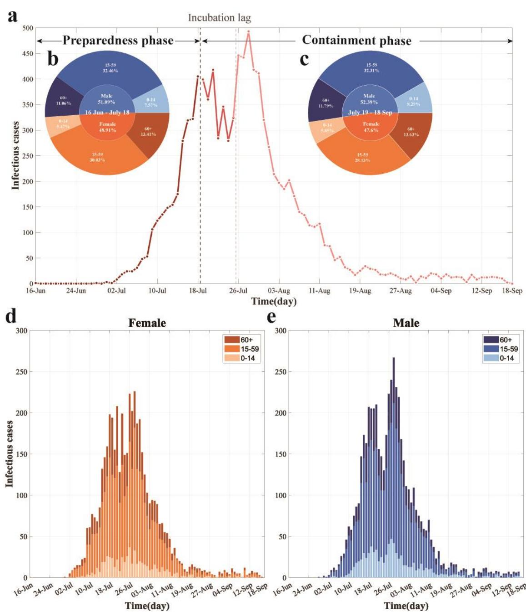

**Fig. 1 Temporal dynamics and demographic characteristics of the largest recorded CHIK outbreak in China. (a)** Daily reported cases by containment phase. The timeline is segmented into distinct phases, annotated with black text and arrows, with colors indicating temporal progression. **(b–c)** Age and sex distribution of incident cases during the preparedness phase (b) and containment phase (c). (d–e) Daily cases by age group among females (d) and males (e). Colors represent sex (blue: male; orange: female) and age groups (light to dark shades: 0–14, 15– 59, and 60+ years, respectively).

# **Basic Reproduction Number with Sex-Age Structure**

The disease-free equilibrium (DFE) represented by

 $E_0 = \left(S_{m10}, 0.0, 0.0, S_{f10}, 0.0, 0.0, \dots, S_{mk0}, 0.0, 0.0, S_{fk0}, 0.0, 0.0, S_{a0}, 0.0, S_{v0}, 0.0\right)_{1 \times (10k+5)},$ in which  $N_p = \sum_{j=1}^k (S_{mj0} + S_{fj0})$  and  $N_v = S_{a0} + S_{v0}$ . We calculated the basic reproduction number  $\mathcal{R}_0$  using the next-generation matrix approach described in (30). The nonlinear terms with new infection  $\mathcal{F}$  and the outflow term  $\mathcal{V}$  are given by

$$\mathcal{F} = \begin{pmatrix} \frac{\beta_{vp}IRR_{m1}I_{v}}{N_{pi}} \\ 0 \\ 0 \\ \frac{\beta_{vp}IRR_{f_{1}}S_{f_{1}}I_{v}}{N_{p}} \\ 0 \\ 0 \\ \vdots \\ \frac{\beta_{vp}IRR_{mk}S_{mk}I_{v}}{N_{p}} \\ 0 \\ \frac{\beta_{vp}IRR_{mk}S_{mk}I_{v}}{N_{p}} \\ 0 \\ \frac{\beta_{vp}IRR_{fk}S_{fk}I_{v}}{N_{p}} \\ 0 \\ \frac{\beta_{vp}IRR_{fk}S_{fk}I_{v}}{N_{p}} \\ 0 \\ \frac{\beta_{pv}S_{v}\sum_{j=1}^{k}(I_{mj}+I_{fj}+A_{mj}+A_{fj})}{N_{p}} \\ 0 \\ 0 \\ \frac{\beta_{pv}S_{v}\sum_{j=1}^{k}(I_{mj}+I_{fj}+A_{mj}+A_{fj})}{N_{p}} \\ 0 \\ 0 \\ \frac{\beta_{pv}S_{v}\sum_{j=1}^{k}(I_{mj}+I_{fj}+A_{mj}+A_{fj})}{N_{p}} \\ 0 \\ 0 \\ \frac{\beta_{pv}S_{v}\sum_{j=1}^{k}(I_{mj}+I_{fj}+A_{mj}+A_{fj})}{N_{p}} \\ 0 \\ 0 \\ \frac{\beta_{pv}S_{v}\sum_{j=1}^{k}(I_{mj}+I_{fj}+A_{mj}+A_{fj})}{N_{p}} \\ 0 \\ 0 \\ \frac{\beta_{pv}S_{v}\sum_{j=1}^{k}(I_{mj}+I_{fj}+A_{mj}+A_{fj})}{N_{p}} \\ 0 \\ 0 \\ \frac{\beta_{pv}S_{v}\sum_{j=1}^{k}(I_{mj}+I_{fj}+A_{mj}+A_{fj})}{N_{p}} \\ 0 \\ 0 \\ \frac{\beta_{pv}S_{v}\sum_{j=1}^{k}(I_{mj}+I_{fj}+A_{mj}+A_{fj})}{N_{p}} \\ 0 \\ 0 \\ \frac{\beta_{pv}S_{v}\sum_{j=1}^{k}(I_{mj}+I_{fj}+A_{mj}+A_{fj})}{N_{p}} \\ 0 \\ 0 \\ \frac{\beta_{pv}S_{v}\sum_{j=1}^{k}(I_{mj}+I_{fj}+A_{mj}+A_{fj})}{N_{p}} \\ 0 \\ 0 \\ \frac{\beta_{pv}S_{v}\sum_{j=1}^{k}(I_{mj}+I_{fj}+A_{mj}+A_{fj})}{N_{p}} \\ 0 \\ 0 \\ \frac{\beta_{pv}S_{v}\sum_{j=1}^{k}(I_{mj}+I_{fj}+A_{mj}+A_{fj})}{N_{p}} \\ 0 \\ 0 \\ \frac{\beta_{pv}S_{v}\sum_{j=1}^{k}(I_{mj}+I_{fj}+A_{mj}+A_{fj})}{N_{p}}} \\ 0 \\ \frac{\beta_{pv}S_{v}\sum_{j=1}^{k}(I_{mj}+I_{fj}+A_{mj}+A_{fj})}{N_{p}}} \\ 0 \\ \frac{\beta_{pv}S_{v}\sum_{j=1}^{k}(I_{mj}+I_{fj}+A_{mj}+A_{fj})}{N_{p}}} \\ 0 \\ \frac{\beta_{pv}S_{v}\sum_{j=1}^{k}(I_{mj}+I_{fj}+A_{mj}+A_{fj})}{N_{p}}} \\ 0 \\ \frac{\beta_{pv}S_{v}\sum_{j=1}^{k}(I_{mj}+I_{fj}+A_{mj}+A_{fj})}{N_{p}}} \\ 0 \\ \frac{\beta_{pv}S_{v}\sum_{j=1}^{k}(I_{mj}+I_{fj}+A_{mj}+A_{fj})}{N_{p}}} \\ 0 \\ \frac{\beta_{pv}S_{v}\sum_{j=1}^{k}(I_{mj}+I_{fj}+A_{mj}+A_{fj})}{N_{p}}} \\ 0 \\ \frac{\beta_{pv}S_{v}\sum_{j=1}^{k}(I_{mj}+I_{fj}+A_{mj}+A_{fj})}{N_{p}}} \\ 0 \\ \frac{\beta_{pv}S_{v}\sum_{j=1}^{k}(I_{mj}+I_{fj}+A_{mj}+A_{fj})}{N_{p}}} \\ 0 \\ \frac{\beta_{pv}S_{v}\sum_{j=1}^{k}(I_{mj}+I_{fj}+A_{mj}+A_{fj})}{N_{p}}} \\ 0 \\ \frac{\beta_{pv}S_{v}\sum_{j=1}^{k}(I_{mj}+I_{fj}+A_{mj}+A_{fj})}{N_{p}}} \\ 0 \\ \frac{\beta_{pv}S_{v}\sum_{j=1}^{k}(I_{mj}+I_{jj}+A_{jj}+A_{jj})}{N_{p}}} \\ 0 \\ \frac{\beta_{pv}S_{v}\sum_{j=1}^{k}(I_{mj}+I_{jj}+A_{jj}+A_{jj})}{N_{p}}} \\ 0 \\ \frac{\beta_{pv}S$$

The Jacobian matrices of 
$$\mathcal{F}$$
 and  $\mathcal{V}$  at the DFE  $E_0$  are
$$F(E_0) = \begin{pmatrix} 0_{6k \times 6k} & F_1 \\ F_2 & 0_{2 \times 2} \end{pmatrix},$$

and

$$V(E_0) = \begin{pmatrix} V_1 & 0_{6k \times 2} \\ 0_{2 \times 6k} & V_2 \end{pmatrix},$$

respectively, of which

$$F_{1} = \begin{pmatrix} 0 & \frac{\beta_{vp}IRR_{m1}S_{m10}}{N_{p}} \\ 0 & 0 \\ 0 & 0 \\ 0 & \frac{\beta_{vp}IRR_{f1}S_{f10}}{N_{p}} \\ 0 & 0 \\ \vdots & \vdots \\ 0 & \frac{\beta_{vp}IRR_{mk}S_{mk0}}{N_{p}} \\ 0 & 0 \\ 0 & 0 \\ 0 & 0 \\ 0 & \frac{\beta_{vp}IRR_{mk}S_{mk0}}{N_{p}} \\ 0 & 0 \\ 0 & 0 \\ 0 & 0 \\ 0 & 0 \end{pmatrix},$$

$$V_1 = I_{2k} \otimes \begin{pmatrix} q\omega' + (1-q)\omega & 0 & 0 \\ -(1-q)\omega & \gamma & 0 \\ -q\omega' & 0 & \gamma' \end{pmatrix}, V_2 = \begin{pmatrix} (d+\varpi) & 0 \\ -\varpi & d \end{pmatrix}.$$

Then, the basic reproduction number  $\mathcal{R}_0$  of model (1) is the spectral radius of the next generation matrix  $FV^{-1}(E_0)$ . Direct calculation gives

$$\mathcal{R}_0 = \sqrt{\mathcal{R}_{0(vp) \times} \mathcal{R}_{0(pv)}},$$

in which,

$$\begin{split} \mathcal{R}_{0(vp)} &= \frac{\sum_{j=1}^{k} \left( \frac{\beta_{vp} IRR_{mj} S_{mj0}}{N_{p}} (1-q) \omega \right)}{[q \omega' + (1-q) \omega] \gamma} + \frac{\sum_{j=1}^{k} \left( \frac{\beta_{vp} IRR_{mj} S_{mj0}}{N_{p}} q \omega' \right)}{[q \omega' + (1-q) \omega] \gamma'} \\ &+ \frac{\sum_{j=1}^{k} \left( \frac{\beta_{vp} IRR_{fj} S_{fj0}}{N_{p}} (1-q) \omega \right)}{[q \omega' + (1-q) \omega] \gamma} + \frac{\sum_{j=1}^{k} \left( \frac{\beta_{vp} IRR_{fj} S_{fj0}}{N_{pi}} q \omega' \right)}{[q \omega' + (1-q) \omega] \gamma'} \\ &= \mathcal{R}_{0(vpI_{m})} + \mathcal{R}_{0(vpA_{m})} + \mathcal{R}_{0(vpI_{f})} + \mathcal{R}_{0(vpA_{f})}, \\ &\mathcal{R}_{0(pv)} &= \frac{\beta_{pv} S_{v0}}{N_{p}} \varpi \end{split}$$

 $\mathcal{R}_{0(pv)}$  represents the average number of secondary human infections produced by a single infected mosquito per unit time in a fully susceptible human population. Specifically, this value can be disaggregated into the sum of four components: the number of secondary symptomatic male infections  $\mathcal{R}_{0(vpI_m)}$ , asymptomatic male infections  $\mathcal{R}_{0(vpA_m)}$ , symptomatic female infections  $\mathcal{R}_{0(vpI_f)}$ , and asymptomatic female infections  $\mathcal{R}_{0(vpA_f)}$ . Each of these components is further stratified by  $j(j=1,\ldots,k)$  age groups. Similarly,  $\mathcal{R}_{0(pv)}$  represents the average number of secondary infected mosquitoes produced by a susceptible mosquito, per unit time, through biting the infected population.

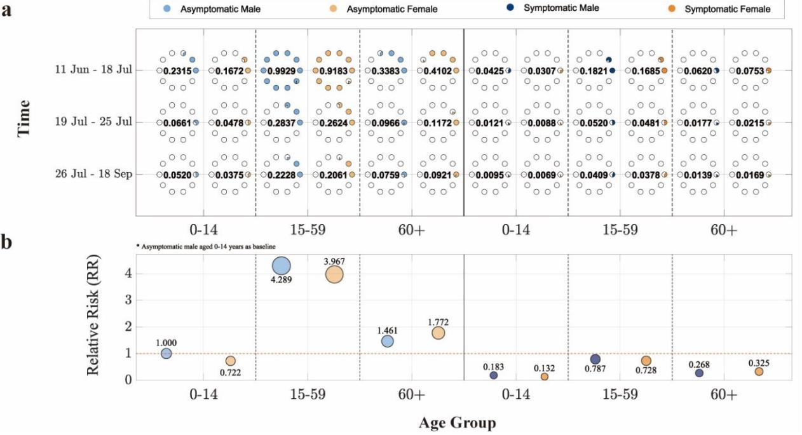

Fig. 2 Demographic decomposition and relative risk analysis of the basic reproduction number ( $\mathcal{R}_0$ ) in the largest CHIK outbreak in China. (a)  $\mathcal{R}_0$  stratified by sex, age group, and infection status (asymptomatic/symptomatic) across different containment phases. The horizontal axis represents age groups, the vertical axis indicates time periods, and point size corresponds to

 ℛ0 values (each hollow circle represents 0.1). **(b)** Relative risk of other population subgroups compared to the reference group (asymptomatic males aged 0–14 years). The solid red line marks the baseline. The vertical position and area of each circle denote the magnitude of relative risk. Blue and orange colors denote male and female cases, respectively, while light and dark blue shades represent asymptomatic and symptomatic infections.

 In the decomposition analysis of the basic reproduction number, ℛ0 was disaggregated into two transmission pathways: "human-to-mosquito" and "mosquito-to-human," with their geometric mean representing the overall ℛ0 of the model (specific values are provided in Table 1). For demographic analysis, the population was divided into three age groups ( = 3). The "mosquito- to-human" component was further decomposed into 12 subcomponents, with detailed contributions illustrated in Fig. 2.

 During the preparedness phase, the overall ℛ0 remained at a relatively high level. The contribution of "human-to-mosquito" transmission was significantly greater than that of "mosquito-to-human" transmission. The population-wide ℛ0 during this phase was 3.6197, exceeding 1, indicating a trend of epidemic expansion. In terms of infection status, asymptomatic individuals contributed more to transmission than symptomatic cases. Among age groups, the 15– 59 years group played the most prominent role in transmission. The ℛ0 contribution from asymptomatic individuals in this age group reached 0.9929 for males and 0.9183 for females. This was followed by individuals aged 60 and above, among whom the ℛ0 contribution from asymptomatic infections was higher in females (0.4102) than in males (0.3383).

 During the containment phase, although "human-to-mosquito" transmission remained stronger than "mosquito-to-human" transmission, the overall population ℛ0 decreased to 0.8665, falling below 1. This suggests that control measures were effective and the outbreak was brought under improved control. In this phase, asymptomatic individuals in the 15–59 years age group remained the primary contributors to ℛ0, with slightly higher values in males (0.2377) than in females (0.2199). When the containment phase was further divided by the incubation lag, the overall model ℛ0 during the lag period was slightly lower than in the subsequent period. Further decomposition revealed that although "human-to-mosquito" transmission was lower during the lag period than later, both "mosquito-to-human" transmission and the ℛ0 contributions across population subgroups were higher during the lag period. The analysis also reaffirmed that asymptomatic individuals aged 15–59 consistently represented the group with the highest ℛ0 contribution throughout.

**Table 1. Contribution of cross-species transmission pathways to the basic reproduction number () in the largest CHIK outbreak in China**

| Time          | 𝓡𝟎      | 𝓡𝟎(𝒗𝒑) | 𝓡𝟎(𝒑𝒗)  |
|---------------|---------|--------|---------|
| 11 Jun-18 Jul | 10.1235 | 3.6197 | 28.3132 |
| 19 Jul-18 Sep | 1.3865  | 0.8665 | 2.2185  |
| 19 Jul-25 Jul | 1.2934  | 1.0341 | 1.6178  |
| 26 Jul-18 Sep | 1.3243  | 0.8122 | 2.1593  |

## **HMC-Optimized Strategy Validation**

 To evaluate the effectiveness of intervention strategies for CHIK, we incorporated three distinct control pathways—controlling mosquito-to-human transmission, controlling human-to- mosquito transmission, and suppressing mosquito populations through net deployment—into Model (1) as control functions () = (1(), 2(), 3()) (see Table 2). A Hamiltonian system was formulated to quantitatively assess the optimal initiation timing and implementation intensity of each intervention in controlling the outbreak.

**Table 2. Parameterization of Intervention Measures**

|  | Intervention pathway | Control functions | Parameter adjustment |
|--|----------------------|-------------------|----------------------|
|--|----------------------|-------------------|----------------------|

| ① Mosquito-to-human transmission control | $u_1(t)$ | $\beta_{vp} \triangleq (1 - u_1(t))\beta_{vp}$ |
|------------------------------------------|----------|------------------------------------------------|
| ② Human-to-mosquito transmission control | $u_2(t)$ | $\beta_{pv} \triangleq (1 - u_2(t))\beta_{pv}$ |
| 3 Mosquito population suppression        | $u_3(t)$ | $N_{v} = (1 - u_3(t))xN_{v}$                   |

The structure of system by incorporating the above control measures was given below:

$$\begin{cases} \frac{dS_{mj}}{dt} = -\frac{(1-u_1(t))\beta_{vp}IRR_{mj}S_{mj}I_v}{N_p}, \\ \frac{dE_{mj}}{dt} = \frac{(1-u_1(t))\beta_{vp}IRR_{mj}S_{mj}I_v}{N_p} - q\omega'E_{mj} - (1-q)\omega E_{mj}, \\ \frac{dI_{mj}}{dt} = (1-q)\omega E_{mj} - \gamma I_{mj}, \\ \frac{dA_{mj}}{dt} = q\omega'E_{mj} - \gamma'A_{mj}, \\ \frac{dR_{mj}}{dt} = \gamma I_{mj} + \gamma'A_{mj}, \\ \frac{dS_{fj}}{dt} = -\frac{(1-u_1(t))\beta_{vp}IRR_{fj}S_{fj}I_v}{N_p}, \\ \frac{dE_{fj}}{dt} = \frac{(1-u_1(t))\beta_{vp}IRR_{fj}S_{fj}I_v}{N_p} - q\omega'E_{fj} - (1-q)\omega E_{fj}, \end{cases}$$

$$\begin{cases} \frac{dI_{fj}}{dt} = (1-q)\omega E_{fj} - \gamma I_{fj}, \\ \frac{dA_{fj}}{dt} = q\omega'E_{fj} - \gamma'A_{fj}, \\ \frac{dR_{fij}}{dt} = \gamma I_{fj} + \gamma'A_{fj}, \\ \frac{dS_a}{dt} = ac[(1-u_3(t))xN_p - nI_a] - \lambda S_a, \\ \frac{dI_a}{dt} = acnI_a - \lambda I_a, \\ \frac{dS_v}{dt} = \lambda S_a - \frac{(1-u_2(t))\beta_{pv}S_v \sum_{j=1}^k (I_{mj} + I_{fj} + A_{mj} + A_{fj})}{N_p} - dS_v, \\ \frac{dE_v}{dt} = \frac{(1-u_2(t))\beta_{pv}S_v \sum_{j=1}^k (I_{mj} + I_{fj} + A_{mj} + A_{fj})}{N_p} - (d + \varpi)E_v, \\ \frac{dI_v}{dt} = \lambda I_a + \varpi E_v - dI_v. \end{cases}$$

Our main objective was to minimize the number of new cases in symptomatic classes and the costs required to control epidemic. Consequently, the objective functional was defined as

$$G(u(t)) = \int_0^T \left[ \sum_{j=1}^k \left( p_{mj} I_{mj} + p_{fj} I_{fj} \right) + \frac{p_{k+1}}{2} u_1^2(t) + \frac{p_{k+2}}{2} u_2^2(t) + \frac{p_{k+3}}{2} u_3^2(t) \right] dt, \quad (3)$$

where, the constants  $p_{mj}$ ,  $p_{fj}$ , (j = 1, ..., k) are the weight factors for the symptomatic classes  $I_{mj}$ ,  $I_{fj}$ , (j = 1, ..., k), respectively, while  $p_{k+1}$ ,  $p_{k+2}$ , and  $p_{k+3}$  are the corresponding cost factors. The core task was to determine the optimal controls for  $u^* = (u_1^*, u_2^*, u_3^*)$  based on the Pontryagin maximum principle, such that

$$G(u^*) = \min_{\Theta} G(u(t)), \tag{4}$$

where,  $\Theta = \{u(t) \in L^3(0,T) | u_{min} \le u_1(t), u_2(t), u_3(t) \le u_{max}, t \in (0,T)\}$  is the control set, T is represented the final step size, and  $L^3(0,T)$  is the set of integrable functions defined on the interval (0,T).

To begin solving the optimal problem, we focused on the Lagrangian and Hamiltonian for Eqs. (2) to (4). The Lagrangian for the optimal problem is defined as follows:

$$\mathcal{L} = \sum_{j=1}^{k} \left( p_{mj} I_{mj} + p_{fj} I_{fj} \right) + \frac{p_{k+1}}{2} u_1^2(t) + \frac{p_{k+2}}{2} u_2^2(t) + \frac{p_{k+3}}{2} u_3^2(t).$$
 (5)

To find the minimum value of Eq. (5), we introduced the Hamiltonian function  $\mathcal{H}$  defined as follows:

$$\mathcal{H} = L + \sum_{i=1}^{10k+5} \eta_i f_i,\tag{6}$$

where,  $f_i$  is the right-hand side of the differential Eq. (2) of the i-th state variable, and  $\eta_i$  is the adjoint-vector. Based on the existence of an optimal solution for the control problem, the following Theorem 1 can be obtained.

**Theorem 1** Let  $S_{mj}^*$ ,  $E_{mj}^*$ ,  $I_{mj}^*$ ,  $A_{mj}^*$ ,  $R_{mj}^*$ ,  $S_{fj}^*$ ,  $E_{fj}^*$ ,  $I_{fj}^*$ ,  $A_{fj}^*$ ,  $R_{fj}^*$ ,  $S_a^*$ ,  $I_a^*$ ,  $S_v^*$ ,  $E_v^*$ ,  $I_v^*$ , (j = 1, ..., k) represent the state solutions associated with the optimal control measures  $u_1^*$ ,  $u_2^*$ ,  $u_3^*$  for the optimum control system stated in (2) and (3). Then, we derive the adjoint variables  $\eta_i(i = 1, ..., 10k + 5)$  that satisfy:

$$\frac{d\eta_{10(j-1)+1}}{dt} = \eta_{10(j-1)+1}C_{1m} - \eta_{10(j-1)+2}C_{1m},$$

$$\frac{d\eta_{10(j-1)+2}}{dt} = \eta_{10(j-1)+2}[q\omega' + (1-q)\omega] - \eta_{10(j-1)+3}(1-q)\omega - \eta_{10(j-1)+4}q\omega',$$

$$\frac{d\eta_{10(j-1)+3}}{dt} = -p_{mj} + p\eta_{10(j-1)+3}\gamma - \eta_{10(j-1)+5}\gamma + \eta_{10k+3}C_2 - \eta_{10k+4}C_2,$$

$$\frac{d\eta_{10(j-1)+4}}{dt} = \eta_{10(j-1)+4}\gamma' - \eta_{10(j-1)+5}\gamma' + \eta_{10k+3}C_2 - \eta_{10k+4}C_2,$$

$$\frac{d\eta_{10(j-1)+5}}{dt} = 0,$$

$$\frac{d\eta_{10(j-1)+6}}{dt} = \eta_{10(j-1)+6}C_{1f} - \eta_{10(j-1)+7}C_{1f},$$

$$\frac{d\eta_{10(j-1)+7}}{dt} = \eta_{10(j-1)+7}[q\omega' + (1-q)\omega] - \eta_{10(j-1)+8}(1-q)\omega - \eta_{10(j-1)+9}q\omega',$$

$$\frac{d\eta_{10(j-1)+8}}{dt} = -p_{fj} + p\eta_{10(j-1)+8}\gamma - \eta_{10j}\gamma + \eta_{10k+3}C_2 - \eta_{10k+4}C_2,$$

$$\frac{d\eta_{10(j-1)+9}}{dt} = \eta_{10(j-1)+\gamma}' - \eta_{10j}\gamma' + \eta_{10k+3}C_2 - \eta_{10k+4}C_2,$$

$$\frac{d\eta_{10k+1}}{dt} = \eta_{10k+1}\lambda - \eta_{10k+3}\lambda,$$

$$\frac{d\eta_{10k+2}}{dt} = \eta_{10k+1}acn - \eta_{10k+2}(acn - \lambda) - \eta_{10k+5}\lambda,$$

$$\frac{d\eta_{10k+3}}{dt} = \eta_{10k+3}[C_3 + d] - \eta_{10k+4}C_3,$$

$$\frac{d\eta_{10k+4}}{dt} = \eta_{10k+4}(d+\varpi) - \eta_{10k+5}\varpi,$$

$$\frac{d\eta_{10k+4}}{dt} = \eta_{10k+4}(d+\varpi) - \eta_{10k+5}\varpi,$$

$$\frac{d\eta_{10k+4}}{dt} = \eta_{10k+4}(d+\varpi) - \eta_{10k+5}\varpi,$$

$$\frac{d\eta_{10k+4}}{dt} = \eta_{10k+4}(d+\varpi) - \eta_{10k+6}(d+\varpi) - \eta_{10(j-1)+7}(C_{4f}] + \eta_{10k+5}d,$$

$$\frac{d\eta_{10k+5}}{dt} = \sum_{i=1}^{k} \left[ (\eta_{10(i-1)+1} - \eta_{10(i-1)+2})C_{4m} + (\eta_{10(i-1)+6} - \eta_{10(i-1)+7})C_{4f} \right] + \eta_{10k+5}d,$$

 $\left(\frac{d\eta_{10k+5}}{dt} = \sum_{j=1}^{k} \left[ \left( \eta_{10(j-1)+1} - \eta_{10(j-1)+2} \right) C_{4m} + \left( \eta_{10(j-1)+6} - \eta_{10(j-1)+7} \right) C_{4f} \right] + \eta_{10k+5} d,$ with boundary conditions or transversality conditions

$$\eta_i(T)=0,$$

where,

$$\begin{split} C_{1m} &= \frac{\left(1 - u_1(t)\right)\beta_{vp}IRR_{mj}I_v}{N_p}, C_{1f} = \frac{\left(1 - u_1(t)\right)\beta_{vp}IRR_{fj}I_v}{N_p}, \\ C_2 &= \frac{\left(1 - u_2(t)\right)\beta_{pv}S_v}{N_p}, C_3 = \frac{\left(1 - u_2(t)\right)\beta_{pv}\sum_{j=1}^k \left(I_{mj} + I_{fj} + A_{mj} + A_{fj}\right)}{N_p}, \\ C_{4m} &= \frac{\left(1 - u_1(t)\right)\beta_{vp}IRR_{mj}S_{mj}}{N_p}, C_{4f} = \frac{\left(1 - u_1(t)\right)\beta_{vp}IRR_{fj}S_{fj}}{N_p}. \end{split}$$

Moreover, the control measures  $u_1^*$ ,  $u_2^*$ ,  $u_3^*$  are given by

$$\begin{cases} u_{1}^{*}(t) = max \left\{ min \left\{ u_{min}, \frac{\sum_{j=1}^{k} \left[ \left[ \eta_{10(j-1)+2} - \eta_{10(j-1)+1} \right] \frac{\beta_{vp} IRR_{mj} S_{mj} I_{v}}{N_{p}} + \left[ \eta_{10(j-1)+7} - \eta_{10(j-1)+6} \right] \frac{\beta_{vp} IRR_{fj} S_{fj} I_{v}}{N_{p}} \right\} \right\}, u_{max} \right\}, \\ u_{2}^{*}(t) = max \left\{ min \left\{ u_{min}, \frac{(\eta_{10k+4} - \eta_{10k+3}) \frac{\beta_{pv} S_{v} \sum_{j=1}^{k} \left( I_{mj} + I_{fj} + A_{mj} + A_{fj} \right)}{N_{p}}}{N_{p}} \right\}, u_{max} \right\}, \\ u_{3}^{*}(t) = max \left\{ min \left\{ u_{min}, \frac{\eta_{10k+1} acx N_{p}}{p_{k+2}} \right\}, u_{max} \right\}. \end{cases}$$

$$(8)$$

**Proof** Based on the Pontryagin maximum principle and the Hamiltonian function (Eq.(6)), the adjoint equation is obtained as follows:

$$\frac{d\eta_{10(j-1)+1}}{dt} = -\frac{\partial H}{\partial S_{mj}} = -\sum_{i=1}^{10k+5} \eta_i \frac{\partial f_i}{\partial S_{mj}},$$

$$\frac{d\eta_{10(j-1)+2}}{dt} = -\frac{\partial H}{\partial E_{mj}} = -\sum_{i=1}^{10k+5} \eta_i \frac{\partial f_i}{\partial E_{mj}},$$

$$\frac{d\eta_{10(j-1)+3}}{dt} = -\frac{\partial H}{\partial I_{mj}} = -p_{mj} - \sum_{i=1}^{10k+5} \eta_i \frac{\partial f_i}{\partial I_{mj}},$$

$$\frac{d\eta_{10(j-1)+4}}{dt} = -\frac{\partial H}{\partial A_{mj}} = -\sum_{i=1}^{10k+5} \eta_i \frac{\partial f_i}{\partial A_{mj}},$$

$$\frac{d\eta_{10(j-1)+5}}{dt} = -\frac{\partial H}{\partial R_{mj}} = -\sum_{i=1}^{10k+5} \eta_i \frac{\partial f_i}{\partial R_{mj}},$$

$$\frac{d\eta_{10(j-1)+6}}{dt} = -\frac{\partial H}{\partial E_{fj}} = -\sum_{i=1}^{10k+5} \eta_i \frac{\partial f_i}{\partial E_{fj}},$$

$$\frac{d\eta_{10(j-1)+7}}{dt} = -\frac{\partial H}{\partial I_{fj}} = -p_{fj} - \sum_{i=1}^{10k+5} \eta_i \frac{\partial f_i}{\partial E_{fj}},$$

$$\frac{d\eta_{10(j-1)+9}}{dt} = -\frac{\partial H}{\partial A_{fj}} = -\sum_{i=1}^{10k+5} \eta_i \frac{\partial f_i}{\partial A_{fj}},$$

$$\frac{d\eta_{10k+1}}{dt} = -\frac{\partial H}{\partial S_a} = -\sum_{i=1}^{10k+5} \eta_i \frac{\partial f_i}{\partial S_a},$$

$$\frac{d\eta_{10k+1}}{dt} = -\frac{\partial H}{\partial I_a} = -\sum_{i=1}^{10k+5} \eta_i \frac{\partial f_i}{\partial S_a},$$

$$\frac{d\eta_{10k+2}}{dt} = -\frac{\partial H}{\partial I_a} = -\sum_{i=1}^{10k+5} \eta_i \frac{\partial f_i}{\partial S_a},$$

$$\frac{d\eta_{10k+3}}{dt} = -\frac{\partial H}{\partial S_a} = -\sum_{i=1}^{10k+5} \eta_i \frac{\partial f_i}{\partial S_b},$$

$$\begin{split} \frac{d\eta_{10k+4}}{dt} &= -\frac{\partial H}{\partial E_v} = -\sum_{\substack{i=1\\10k+5}}^{10k+5} \eta_i \frac{\partial f_i}{\partial E_v}, \\ \frac{d\eta_{10k+5}}{dt} &= -\frac{\partial H}{\partial I_v} = -\sum_{\substack{i=1\\10k+5}}^{10k+5} \eta_i \frac{\partial f_i}{\partial I_v}, \end{split}$$

subject to boundary time conditions (i.e. final)  $\eta_i(T) = 0$ , i = 1, ..., 10k + 5. In order to achieve the desired problem (8), we utilized the following equations:

$$\frac{\partial H}{\partial u_1} = 0,$$

$$\frac{\partial H}{\partial u_2} = 0,$$

$$\frac{\partial H}{\partial u_3} = 0.$$

By utilizing the property of the control space  $\Theta$  being in the interior of the control set, we obtained the desired result.

The theoretical framework was applied to analyze the largest recorded CHIK outbreak in China. Considering that human interventions cannot completely interrupt transmission, the control parameters were bounded between  $u_{\min} = 0.2$  and  $u_{\max} = 0.8$ . First, Model (1) was used to fit infection data from the preparedness phase, stratified into six population groups by sex and age (male: 0–14, 15–59, 60+; female: 0–14, 15–59, 60+). Model parameters were estimated using the PMCMC method (Supplementary Table S2). The estimated parameters were then applied to Model (2) for fitting the containment phase and numerically solving the control functions. Goodness-of-fit comparisons indicated that segmenting the containment phase by the incubation lag significantly improved model performance (Supplementary Fig. S1 and Table S3).

Based on the fitting results of actual epidemic data and the control intensity curves derived from Eqs. (8) (Supplementary Fig. S1), the analysis reveals that mosquito population suppression was maintained at the highest intensity ( $u_3 = 0.8$ ) starting from July 19. However, it was also the first measure to begin decreasing in intensity, gradually declining from September 8 and remaining at the minimum control level ( $u_3 = 0.2$ ) after September 11, with an average intensity of  $u_3 = 0.7086$ . In comparison, both mosquito-to-human transmission control and human-to-mosquito transmission control reached their peak control intensities ( $u_1 = u_2 = 0.8$ ) on July 20. Human-to-mosquito transmission control began to gradually decrease from September 13, dropping to its minimum ( $u_2 = 0.2$ ) by September 15, with an average intensity of  $u_2 = 0.7444$ . In contrast, mosquito-to-human transmission control started to decline from September 15 and reached its lowest influence level ( $u_1 = 0.2$ ) during September 17, with an average intensity of  $u_1 = 0.7086$ .

#### **Evaluation of Combination Strategies**

In this study, we systematically evaluated the effectiveness of three intervention measures—mosquito-to-human transmission control, human-to-mosquito transmission control, and mosquito population suppression—under different implementation strategies. Using "no intervention" and "full implementation of all three measures" as reference scenarios, we simulated changes in infection numbers under single or pairwise combinations of interventions (Fig. 3). Across all six population groups, the effectiveness of the strategies, ranked from highest to lowest, was as follows: "mosquito-to-human transmission control + human-to-mosquito transmission control + mosquito population suppression" (Strategy 8) > "mosquito-to-human transmission control + mosquito population suppression" (Strategy 7) > "mosquito population suppression" (Strategy 4) > "mosquito-to-human transmission control + human-to-mosquito transmission control" (Strategy 4) > "mosquito-to-human transmission control + human-to-mosquito transmission control" (Strategy 4) > "mosquito-to-human transmission control + human-to-mosquito transmission control" (Strategy 4)

5) > "human-to-mosquito transmission control" (Strategy 3) > "mosquito-to-human transmission control" (Strategy 2) > "no control" (Strategy 1). Under the no-intervention scenario, the final epidemic size was the largest, whereas the combined implementation of all three measures resulted in the smallest final size, with an average reduction of 95.7586% in infections compared to the no-intervention scenario. The greatest reduction was observed among males aged 15–59 years (95.7620%), while the smallest reduction was seen in females aged 0–14 years (95.7518%).

Among the single-intervention strategies, mosquito population suppression was the most effective, reducing the final epidemic size by an average of 78.4695% (range: 78.4611%— 78.4764%) compared to the no-intervention scenario. This was followed by human-to-mosquito transmission control, which led to an average reduction of 25.6044% (25.5899%–25.6102%). Mosquito-to-human transmission control alone had the lowest impact, with an average reduction of 17.8302% (17.8170%–17.8365%). In terms of demographic variations, mosquito population suppression and human-to-mosquito transmission control were most effective for males aged 15– 59 years, whereas mosquito-to-human transmission control performed best for females aged 0–14 years. All single measures showed the weakest effects for females aged 60 years and above. Among the two-measure combinations, mosquito-to-human transmission control + mosquito population suppression was the most effective, reducing the final epidemic size by an average of 81.5226% (81.5135%–81.5285%). This was followed by human-to-mosquito transmission control + mosquito population suppression, with an average reduction of 80.7287% (80.7208%– 80.7352%). The combination of mosquito-to-human transmission control + human-to-mosquito transmission control had the lowest impact, with an average reduction of 35.7960% (35.7772%-35.7772%), which was even lower than that of mosquito population suppression alone. In terms of demographic responses, mosquito-to-human transmission control + mosquito population suppression and human-to-mosquito transmission control + mosquito population suppression were most effective for males aged 15–59 years, while mosquito-to-human transmission control + human-to-mosquito transmission control worked best for females aged 0–14 years. All twomeasure combinations continued to show the weakest effects for females aged 60 years and above.

Table 3. Design of Intervention Strategy Combinations Based on Transmission Pathway Analysis

| Strategy                | Mosquito-to-human transmission control $u_1$ | Human-to-mosquito transmission control $u_2$ | Mosquito population suppression $u_3$ |
|-------------------------|----------------------------------------------|----------------------------------------------|---------------------------------------|
| Strategy 1 0 | 0                                            | 0                                            | 0                                     |
| Strategy 2              | <b>HMC-Estimated</b>                         | 0                                            | 0                                     |
| Strategy 3              | 0                                            | <b>HMC-Estimated</b>                         | 0                                     |
| Strategy 4              | 0                                            | 0                                            | <b>HMC-Estimated</b>                  |
| Strategy 5              | <b>HMC-Estimated</b>                         | <b>HMC-Estimated</b>                         | 0                                     |
| Strategy 6              | <b>HMC-Estimated</b>                         | 0                                            | <b>HMC-Estimated</b>                  |
| Strategy 7              | 0                                            | <b>HMC-Estimated</b>                         | <b>HMC-Estimated</b>                  |
| Strategy 8 1 | <b>HMC-Estimated</b>                         | <b>HMC-Estimated</b>                         | <b>HMC-Estimated</b>                  |

**Note:** 0 represents the blank control group with no intervention applied to any transmission pathway; 1 represents the control group where interventions are applied to all transmission pathways at the actually observed intensity.

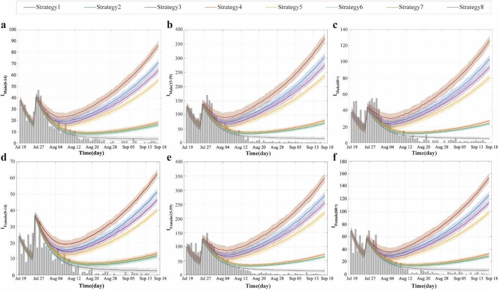

**Fig. 3 Simulated infection counts by population group under different control strategies in the largest recorded CHIK outbreak in China. (a–f)** Temporal dynamics of infections for six population groups: males 0–14 years (a), males 15–59 years (b), males 60+ years (c), females 0– 14 years (d), females 15–59 years (e), and females 60+ years (f). Dark gray bars represent observed infections. The dark red curve (Strategy 1) represents the no-intervention control group based on segmented fitting of Model (1), while the dark gray curve (Strategy 8) corresponds to the actual control group based on segmented fitting of Model (2).

# **Dose-Response Effects of Interventions**

 We conducted parameter sweeps for three control measures—mosquito-to-human transmission control (1), human-to-mosquito transmission control (2), and mosquito population suppression (3)—by varying each within the range (0, 1) and systematically evaluated the impact of 1,331 control combinations on the effective reproduction number (ℛ). Results showed that across all scenarios, the ℛ for the "human-to-mosquito" transmission pathway (ℛ() ) was consistently and significantly higher than that for the "mosquito-to-human" pathway (ℛ() ).

 Theoretically, setting any single control parameter to 1 (i.e., implementing extreme-intensity isolation or vector control) would reduce the overall system ℛ to zero, achieving complete transmission interruption. However, such extreme intensity is often impractical in real-world interventions. To identify feasible control strategies, we fixed one parameter at its actual value based on empirical data and adjusted the other two, identifying multiple non-extreme control combinations capable of reducing ℛ below 1 (Fig. 4a-c):

- With 1 fixed at its actual value, settings of (2=0.6, 3=0.9), (2= 0.8, 3=0.8), or (2= 0.9, 3=0.6) all achieved ℛ=0.9737.
- With 2 fixed at its actual value, combinations (1= 0.7, 3=0.9) or (1= 0.9, 3=0.7) reduced ℛ=0.8865.
- With 3 fixed at its actual value, combinations (1= 0.7, 2=0.9) or (1= 0.9, 2=0.7) resulted in ℛ=0.9465.

 All the above outcomes satisfy ℛ< 1, indicating that the outbreak can be effectively controlled. Further analysis revealed that beyond these threshold combinations, increasing the intensity of any control measure further reduced ℛ and enhanced control effectiveness.

 Based on the mathematical structure of the basic reproduction number (ℛ0) and simulation results, mosquito-to-human transmission control (1) had a relatively limited impact on the effective reproduction number for human-to-mosquito transmission (ℛ() ) (Fig. 4d). Specifically, when 2=0.7 and 3=0.9, or 2=0.9 and 3=0.7, ℛ() remained constant at 0.8494 regardless of the value of 1. Systematically increasing the intensity of any control measure beyond these combinations further reduced the ℛ() value. On the other hand, human-to-mosquito transmission control (2) and mosquito population suppression (3) exhibited limited influence on the effective reproduction number for mosquito-to-human transmission (ℛ() ) (Fig. 4e). When u₁ reached the actual implementation level, ℛ() could be stably controlled below 1. Further simulations demonstrated that when either 2 or 3 was fixed at its actual value, increasing 1 to 0.8 was sufficient to reduce ℛ() to 0.7239, even with fluctuations in the other parameter. This indicates that transmission within the human population was effectively contained under such conditions.

 Under scenarios where the intensities of all three control measures were adjusted simultaneously, the study identified multiple asymmetric strategy combinations capable of reducing ℛ below the epidemic threshold. Specifically, when the intensity of one measure was maintained at 0.1 while the other two were set to 0.9, the system ℛ decreased to 0.9604. Similarly, when one measure was increased to 0.9 while the other two remained at 0.7, the same control effect was achieved. More notably, when the three control intensities were specifically allocated as 0.6, 0.8, and 0.9 (excluding other numerical combinations), the system ℛ was further reduced to 0.9055, indicating significant synergistic and complementary effects among the different interventions. It is important to highlight that, beyond achieving the control effects described above, further increasing the intensity of any single measure continued to lower the ℛ value, demonstrating that each intervention retains potential for continuously enhancing outbreak control effectiveness.

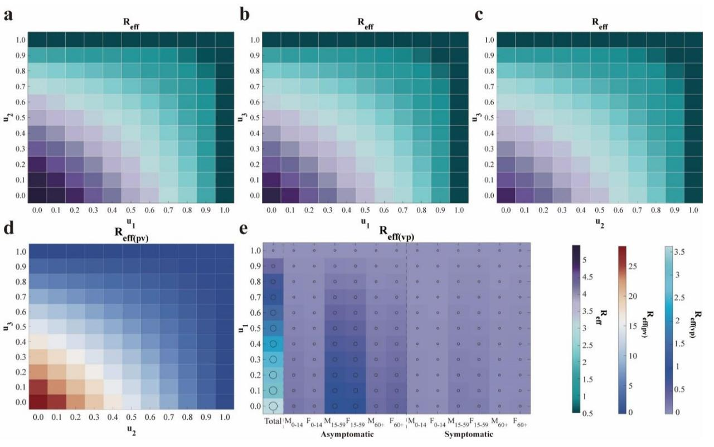

**Fig. 4 Heatmap analysis of the impact of control strategy combinations on the effective reproduction number ( ). (a)–(c)** Effects on the overall ℛ when altering combinations of the other two control measures while fixing one strategy at its actual implementation value. **(d)** Variation of the human-to-mosquito effective reproduction number (ℛ() ) with changes in 2 and 3. **(e)** Variation of the mosquito-to-human effective reproduction number (ℛ() ) and its subcomponents with changes in 1. The axes correspond to the intensities of controlling mosquito-to-human transmission (1), human-to-mosquito transmission (2), and mosquito population suppression (3). Each row of subplots employs a different value range and colormap standard.

### **Discussion**

 This study developed a structural vector-borne model. The model system encompasses two main populations: the human population, structured using an age- and sex-stratified SEIAR compartmental framework, and the mosquito population, which includes both larval (aquatic) and adult stages. The total number of compartments in the system reaches 10 + 5, where represents the number of age groups. Through theoretical analysis of this high-dimensional system of ordinary differential equations, the basic reproduction number (ℛ0) was derived. Its mathematical structure reveals that the transmission contributions from infectious individuals within the same species combine additively to form ℛ0, whereas the contributions from cross- species transmission (e.g., between humans and mosquitoes) are represented by their geometric mean. This finding elucidates the coupling mechanism governing interspecies transmission from a dynamical perspective.

 Existing studies indicate significant age-specific disparities in the global infection burden of CHIK. One modeling estimate suggests approximately 14.4 million annual infections worldwide, with a relatively higher burden among individuals aged 40–60 years, while extreme age groups (e.g., under 10 and over 80 years) exhibit elevated mortality risks (*[5](#page-24-4)*). Furthermore, a systematic analysis of European outbreaks also identified the 45–64 age group as high-risk, with female cases generally outnumbering males (*[12](#page-24-11)*). However, our analysis of the largest CHIK outbreak in China reveals a distinct pattern: cases were slightly more prevalent among males than females, and the 15–59 age group constituted the most affected population. This discrepancy may be attributed to the relatively broad age categorization used in the current study, which led to the 15– 59 group—comprising a large share of the working-age population—dominating the demographic composition. Additionally, individuals in this age range tend to have wider daily mobility and greater exposure to mosquito habitats, further elevating their infection risk. Moreover, this study found that asymptomatic infections within this group contributed substantially to transmission, suggesting their potential role as key drivers of the outbreak, which may partly explain why this demographic emerged as the core affected population in the local epidemic.

 In the study of intervention strategies for vector-borne diseases, although specialized mathematical models for CHIK remain relatively limited, research on diseases with similar transmission mechanisms, such as dengue fever, provides an important reference. Existing studies on vector-borne disease modeling have indicated that rapid containment can be achieved when surveillance, research, community engagement, and governance operate as an integrated and adaptive system (*[45](#page-26-0)*). Further analysis suggests that vector control is a critical component for achieving rapid outbreak containment (*[46](#page-26-1)*), and integrated approaches combining case management, community protection, and mosquito elimination have been demonstrated as the optimal strategy for interrupting virus transmission (*[47-](#page-26-2)[48](#page-26-3)*). The optimal control model developed in this study, based on the largest CHIK outbreak in China data, validates these perspectives: the combined implementation of all three control measures reduced the total number of infections by an average of 95.7586%, demonstrating the significant advantage of synergistic interventions. Mosquito population suppression, as a core intervention, reached and maintained the highest

 intensity earliest during the containment phase and, as a single measure, led to an average reduction in infections of 78.4695%. However, relevant studies have pointed out that unless sustained at very high implementation intensity, the effectiveness of vector control measures may gradually diminish over time, potentially leading to a resurgence of the outbreak during later phases. Premature reduction in control intensity may undermine the sustainability of intervention outcomes (*[49](#page-26-4)*).

 Regarding the synergistic implementation of multiple measures, this study found that the dual strategy of "mosquito-to-human transmission control + mosquito population suppression" was the most effective (reducing infection size by 81.5226%), outperforming other two-measure combinations and single interventions. This aligns with findings from dengue fever research indicating that "the combined use of mosquito nets and insecticides yields the highest infection avoidance rate" (*[49](#page-26-4)*). It is noteworthy that although human-to-mosquito transmission control as a standalone measure had limited effectiveness (25.6044% reduction), its combination with mosquito population suppression significantly enhanced overall containment efficacy (80.7287% reduction). This suggests that multi-pathway transmission blocking is key to improving intervention quality when resources permit. Furthermore, the effects of different measures varied across population groups: mosquito population suppression and human-to-mosquito transmission control were most effective for males aged 15–59 years, while mosquito-to-human transmission control provided better protection for females aged 0–14 years, indicating that intervention strategies should be tailored to population-specific behavioral and exposure characteristics. The findings support the integration of surveillance-response systems, vector control, and community engagement into an adaptive framework to facilitate rapid outbreak containment.

 In the phase-based analysis of epidemic control, this study divided the containment period into incubation lag and post-incubation lag subphases, revealing distinct stage-specific differences in transmission dynamics. The analysis indicated that the overall effective reproduction number (ℛ) during the incubation lag subphase was slightly lower than that in the subsequent subphase, with both "mosquito-to-human" transmission and population-specific contributions remaining relatively low in the earlier subphase. It is noteworthy that asymptomatic individuals aged 15–59 years consistently served as the core transmission group across both subphases, underscoring their pivotal role in outbreak control. These findings align with transmission models that incorporate time-delay effects (*[50](#page-26-5)*), suggesting that the transmission delay induced by the incubation period should be fully considered in intervention assessments. The study further revealed that during the post-incubation lag subphase, the overall system ℛ was 1.3243—still above the epidemic threshold—yet the "mosquito-to-human" transmission intensity (0.8122) had fallen below 1, indicating a potential gradual decline in human transmission. However, the "human-to-mosquito" transmission intensity remained elevated at 2.1593, reflecting persistent viral activity in mosquito populations and a continued risk of outbreak resurgence.

 To effectively contain the spread of the outbreak, this study systematically evaluated the effectiveness of different control strategies, demonstrating that multiple non-extreme control combinations could reduce ℛ below the epidemic threshold. When fixing one intervention at its actual implementation level while optimizing the other two, effective strategies consistently achieved ℛ<1 across scenarios: with u₁ fixed, combinations such as (2=60%, 3=90%), (2=80%, 3=80%), or (2=90%, 3=60%) yielded ℛ=0.9737; with u₂ fixed, combinations like (u₁=70%, u₃=90%) reduced ℛ to 0.8865; and with 3 fixed, configurations such as (1=70%, 2=90%) lowered ℛ to 0.9465. Further analysis revealed distinct pathway-specific effects: mosquito-to-human transmission control (1) exhibited limited influence on human-tomosquito transmission (ℛ() ), which remained stable at 0.8494 when 2 and 3 were set to 70% and 90% respectively, whereas mosquito-to-human transmission (ℛ() ) was primarily controlled by 1, reaching 0.7239 when its intensity attained 80% even under variations in the

other measures. When simultaneously adjusting all three interventions, specific asymmetric intensity allocations—such as single-measure intensity at 10% paired with dual-measure intensity at 90%, or a triple-measure profile of 60%/80%/90%—achieved  $\mathcal{R}_{eff}$  values as low as 0.9055. All control measures demonstrated continuous effectiveness enhancement, where increasing intensity beyond baseline levels consistently yielded further reduction in transmission risk.

This study has several limitations. First, with the recent approval and rollout of the world's first CHIK vaccine, Ixchiq, by the U.S. FDA in 2023 and its subsequent authorization in multiple countries (51), vaccination has become an important intervention strategy. However, the model developed in this study only considers non-pharmaceutical interventions and does not incorporate the role of immunization strategies within the overall control framework. Second, the current model does not fully account for the potential impact of climate change on mosquito distribution and virus transmission. Studies have shown that global warming and altered precipitation patterns are significantly expanding the suitable habitats for Aedes mosquitoes (52-54), increasing transmission risks in temperate regions (55). Yet, the present model does not integrate meteorological variables to reflect this dynamic process. Furthermore, the model inadequately addresses the role of human mobility. In the context of globalization, international travel and cross-regional movement accelerate virus spread (56-57). However, the model is primarily based on local transmission dynamics and does not systematically analyze the impact of imported cases on local outbreaks. Future research should aim to integrate vaccination strategies, climate variables, and human mobility data, combined with genomic approaches, to establish a more comprehensive risk assessment framework.

#### Methods

## Structural Vector-borne Model development

This study developed an age- and sex-structured human-vector transmission dynamic model for CHIK. The human population is stratified into 10k compartments, where k denotes the number of age groups. Specifically, for each age group j (j = 1, ..., k), the model includes the following compartments:

- $S_{mj}/S_{fj}$ : Susceptible males / females in age group j;
- $E_{mj}/E_{fj}$ : Exposed males / females in age group j;
- $I_{mj}/I_{fj}$ : Symptomatically infectious males / females in age group j;
- $A_{mj}/A_{fj}$ : Asymptomatically infectious males / females in age group j;
- $R_{mj}/R_{fj}$ : Recovered males / females in age group j.

And, the vector component comprises five compartments:

- $S_a$ : Susceptible larval mosquitoes;
- $I_a$ : Infected larval mosquitoes;
- $S_v$ : Susceptible adult mosquitoes;
- $E_v$ : Exposed adult mosquitoes;
- $I_{\nu}$ : Infectious adult mosquitoes.

The model is based on the following assumptions:

I. CHIKV transmission occurs exclusively through cross-species interactions, specifically between vectors and humans (vector-to-human or human-to-vector). Direct human-to-human or vector-to-vector transmission is not considered.

II. The effective transmission rate varies across age and sex groups. The rate for the first male age group (m1), denoted as  $\beta_{vp}$ , serves as the baseline. The effective transmission rates for all other groups are derived by multiplying this baseline by the corresponding Incidence Rate Ratio (IRR) (Supplementary Table S1).

III. Upon infection, susceptible individuals enter a latent period during which they are not infectious. Subsequently, with probability q, they progress after an average latency period of  $\frac{1}{\omega'}$  to

become asymptomatic infections, eventually recovering at a rate  $\gamma'$ . Alternatively, with probability (1-q), they undergo a latency period of  $\frac{1}{\omega}$  to become symptomatically infectious, then recover at rate  $\gamma$ .

IV. A proportion (n) of mosquitoes acquire the virus through vertical transmission, influenced by the per capita birth rate of mosquitoes (a). This process is modulated by a seasonal effect factor(c), making the effective vertical transmission rate  $a \cdot c \cdot n$ . Infected larval mosquitoes then develop into infectious adult mosquitoes after an average emergence period of  $\frac{1}{\lambda}$ , gaining the ability to transmit the virus.

V. Newly reproduced larval mosquitoes, except those vertically infected, enter the susceptible larval mosquito compartment. They develop into susceptible adult mosquitoes after an average emergence period of  $\frac{1}{\lambda}$ . Susceptible adult mosquitoes acquire the virus by biting infectious humans, entering the exposed class. After an average extrinsic incubation period of  $\frac{1}{\omega}$ , they transition to the infectious class, capable of transmitting the virus.

The model defines the total human population as

$$N_p = \sum_{j=1}^k (S_{mj} + E_{mj} + I_{mj} + A_{mj} + R_{mj} + S_{fj} + E_{fj} + I_{fj} + A_{fj} + R_{fj}),$$

and the total mosquito population as:

$$N_v = S_a + I_a + S_v + I_v + R_v = x \cdot N_p.$$

For simplicity in subsequent computations,  $N_p$  is treated as constant based on its demographic interpretation. Furthermore, the seasonal effect function is defined as:

$$c \triangleq c(t) = \cos\left(\frac{t-\tau}{T}\right).$$

The model structure is illustrated in Fig. 5, and the corresponding system of equations is given as follows:

$$\begin{cases} \frac{dS_{mj}}{dt} = -\frac{\beta_{vp}IRR_{mj}S_{mj}I_{v}}{N_{p}}, \\ \frac{dE_{mj}}{dt} = \frac{\beta_{vp}IRR_{mj}S_{mj}I_{v}}{N_{p}} - q\omega'E_{mj} - (1 - q)\omega E_{mj}, \\ \frac{dI_{mj}}{dt} = (1 - q)\omega E_{mj} - \gamma I_{mj}, \\ \frac{dA_{mj}}{dt} = q\omega'E_{mj} - \gamma'A_{mj}, \\ \frac{dR_{mj}}{dt} = \gamma I_{mj} + \gamma'A_{mj}, \\ \frac{dS_{fj}}{dt} = -\frac{\beta_{vp}IRR_{fj}S_{fj}I_{v}}{N_{p}}, \\ \frac{dE_{fj}}{dt} = \frac{\beta_{vp}IRR_{fj}S_{fj}I_{v}}{N_{p}} - q\omega'E_{fj} - (1 - q)\omega E_{fj}, \\ \frac{dI_{fj}}{dt} = (1 - q)\omega E_{fj} - \gamma I_{fj}, \\ \frac{dA_{fj}}{dt} = q\omega'E_{fj} - \gamma'A_{fj}, \\ \frac{dS_{a}}{dt} = ac(N_{v} - nI_{a}) - \lambda S_{a}, \\ \frac{dI_{a}}{dt} = acnI_{a} - \lambda I_{a}, \\ \frac{dS_{v}}{dt} = \lambda S_{a} - \frac{\beta_{pv}S_{v}}{2}\sum_{j=1}^{k}(I_{mj}+I_{fj}+A_{mj}+A_{fj})}{N_{p}} - (d + \varpi)E_{v}, \\ \frac{dI_{v}}{dt} = \lambda I_{a} + \varpi E_{v} - dI_{v}. \end{cases}$$

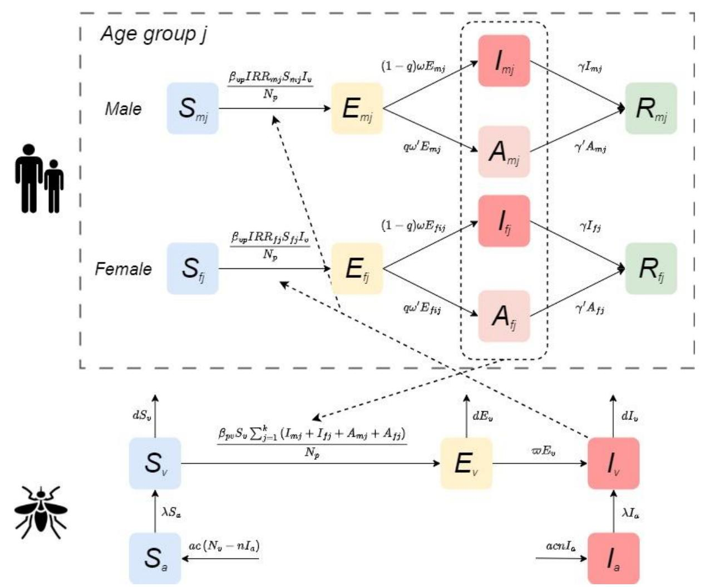

**Fig. 5 Compartmental structure of the CHIKV transmission model.**

### **Data and Parameter Collection**

 The data for this study were sourced from the 2025 CHIK outbreak records released by the World Health Organization (WHO) (*[21\)](#page-25-4)* and relevant literature (*[22\)](#page-25-5)*. To conduct an in-depth analysis of transmission heterogeneity and intervention effectiveness across population groups, Foshan City was selected as the study site due to its experience with the largest local outbreak in Asia during 2025. As a typical area with active *Aedes* mosquito populations, its vector ecology and climatic conditions are representative of southern China and even Southeast Asia. Moreover, the city's epidemic data are systematic and complete, effectively reflecting human infection patterns in a vector-borne transmission context.

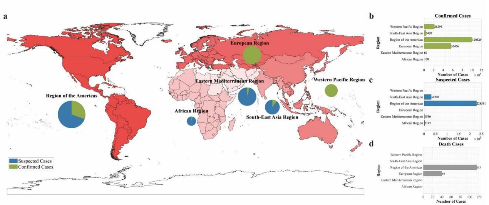

**Fig. 6 Geographic distribution of suspected and confirmed CHIK cases and deaths reported to WHO or shared publicly by national ministries of health by region, as of September 2025. (a)** Burden distribution map by region: color intensity represents case severity, while pie charts show the proportion of suspected versus confirmed cases within each region. **(b)–(d)** Statistics of confirmed cases, suspected cases, and deaths by region, respectively.

 During data preprocessing, the epidemic time series was constructed based on the date of symptom onset. According to the available structured data, all cases were stratified by sex (male, female) and age group (children and adolescents: 0–14 years; adults: 15–59 years; older adults: ≥60 years). According to the key phases of the outbreak, the study period was divided into two main intervals for model fitting: a preparedness phase (16 June–18 July 2025) and a containment phase (19 July–18 September 2025). To account for transmission characteristics, the first 7 days of the containment phase (19–25 July) were further defined as an incubation lag phase, allowing assessment of the potential impact of the latent period on outbreak control.

 Demographic parameters for the model were derived from population statistics published by the Foshan Municipal Bureau of Statistics (*[23\)](#page-25-6)*. The parameters IRR were calculated based on the actual number of infections during the model fitting period. Key transmission parameters, including , , and , were estimated using the Particle Markov Chain Monte Carlo (PMCMC) algorithm (Supplementary Table S2). The remaining parameter values were obtained from published literature. Detailed descriptions, values, and sources of all model parameters are provided in Table 4.

**Table 4. Definition and value of parameters in the transmission dynamics model**

| Parameters | Definition                                                | Unit  | Value | Range     | Source       |
|------------|-----------------------------------------------------------|-------|-------|-----------|--------------|
| 𝛽𝑣𝑝        | Effective transmission rate from mosquitoes to humans  | 1     | -     | 0-1       | Fitting      |
| 𝛽𝑝𝑣        | Effective transmission rate from humans to mosquito | 1     | -     | 0-1       | Fitting      |
| 𝑥          | The ratio of mosquitoes to humans total number      | 1     | -     | 5-15      | Fitting      |
| 𝑎          | Per capita birth rate of mosquitoes                    | Day-1 | 0.145 | 0.02-0.27 | Ref. (24-25) |

| τ                   | Simulation delay in the initial time in the whole season day              | Day               | 30     | -                 | Estimation   |
|---------------------|---------------------------------------------------------------------------|-------------------|--------|-------------------|--------------|
| T                   | Duration of the daily cycle                                               | Day               | 365    | -                 | Estimation   |
| n                   | The minimum infection rate for vertical transmission                      | 1                 | 0.0181 | 0.0076- 0.0286 | Ref. (26-27) |
| λ                   | Rate of mosquito emergence                                                | Day-1             | 0.0902 | 0.0691- 0.1296 | Ref. (28)    |
| d                   | Natural mortality rate of mosquitoes                                      | Day -1 | 1/7.4  | 1/9.8-1/4.5       | Ref. (29)    |
| $\overline{\omega}$ | Transition rate of infection in mosquitoes from exposed to infectious     | Day -1 | 1/5.5  | 1/8.2-1/3         | Ref. (30-33) |
| q                   | Proportion of exposed individuals progressing to asymptomatic individuals | 1                 | 0.155  | 0.03-0.28         | Ref. (34-35) |
| ω                   | Transition rate of exposed individuals to the symptomatic individuals     | Day -1 | 1/4.5  | 1/7-0.5           | Ref. (34-35) |
| $\omega'$           | Transition rate of exposed individuals to the asymptomatic individuals    | Day -1 | 1/4.5  | 1/7-0.5           | Ref. (34-35) |
| γ                   | Recovery rate of symptomatic individuals                                  | Day-1             | 1/7    | -                 | Ref. (36)    |
| $\gamma'$           | Recovery rate of asymptomatic individuals                                 | Day -1 | 1/7    | -                 | Ref. (36)    |

#### **Parameter Estimation**

This study employs the Particle Markov Chain Monte Carlo (PMCMC) method to perform Bayesian inference for the unknown parameter vector  $\theta$  in the dynamic model. The PMCMC framework integrates Particle Filtering (PF) with Markov Chain Monte Carlo (MCMC) sampling, making it particularly suitable for parameter estimation in state-space models characterized by partial observational noise and complex nonlinear dynamics. This approach effectively addresses the challenge of intractable likelihood evaluation inherent in such models (37).

The methodological foundation lies in reformulating parameter estimation as the exploration of the posterior distribution  $p(\theta|y_{1:T})$ , where  $y_{1:T}$  represents the time-series observational data. According to Bayes' theorem, the posterior distribution is proportional to the product of the likelihood function  $p(y_{1:T}|\theta)$  and the prior distribution  $p(\theta)$ :

$$p(\theta|y_{1:T}) \propto p(y_{1:T}|\theta)p(\theta).$$

Within this framework, the goodness-of-fit of parameters is defined by their probability density under the posterior distribution. Regions of higher probability density correspond to parameter values that are more consistent with prior knowledge and demonstrate better compatibility with the observed data.

The posterior distribution of parameters is sampled using a constructive Metropolis-Hastings (M-H) algorithm. This method explores the parameter space sequentially by constructing a Markov chain whose stationary distribution is the target posterior distribution (38). At each iteration k, a candidate parameter value  $\theta^*$  is first generated from a proposal distribution  $q(\theta|\theta^{(k-1)})$ , typically configured as a Gaussian random walk. To evaluate this candidate, a particle filter is invoked to compute its corresponding marginal likelihood estimate  $\hat{p}(y_{1:T}|\theta^*)$ . The particle filter sequentially approximates the filtering distribution of the latent states by maintaining a set of weighted particles  $\left\{x_t^{(i)}, w_t^{(i)}\right\}_{i=1}^N$ , ultimately providing an unbiased estimate of the marginal likelihood:

$$\hat{p}(y_{1:T}|\theta) = \prod_{t=1}^{T} \left( N^{-1} \sum_{i=1}^{N} w_t^{(i)} \right).$$

This estimate is embedded within the MCMC sampler, linking parameters to the observed data and driving the exploration of the parameter space.

Based on the output of the particle filter, the algorithm performs an accept-reject step to update the parameters. The acceptance probability  $\alpha$  for the candidate point  $\theta^*$  is determined by:

$$\alpha = \min \left\{ 1, \frac{\hat{p}(y_{1:T}|\theta^*)p(\theta^*)}{\hat{p}(y_{1:T}|\theta^{k-1})p(\theta^{k-1})}, \frac{q(\theta^{(k-1)}|\theta^*)}{q(\theta^*|\theta^{(k-1)})} \right\}.$$

This mechanism ensures that the Markov chain visits regions of higher posterior probability with frequency proportional to their probability density. After a predefined burn-in period, the sequence of samples  $\{\theta^{(k)}\}$  generated by the Markov chain can be regarded as an approximation of independent and identically distributed samples from the target posterior distribution. Finally, based on this sample set, statistical inference and uncertainty quantification of the parameter values are completed by calculating the posterior mean  $E[\theta|y_{1:T}]$  or posterior mode as a point estimate, and using quantiles to construct credible intervals (39).

# **Optimal Control**

This study first analyzed the key factors influencing epidemic transmission based on the global regional disease burden data up to September 2025 (Supplementary Text). Building on this, and focusing on human-controllable interventions, we developed an intervention transmission dynamics model that incorporates both human population and vector structural features. The model targets three critical pathways: blocking mosquito-to-human transmission, controlling human-to-mosquito transmission, and suppressing the mosquito population. Guided by Pontryagin's Maximum Principle (40), we formulated an optimal control theoretical model, establishing an analytical framework for optimizing disease control strategies (Fig. 7).

To validate this framework, we selected the largest CHIK outbreak recorded in China—the 2025 Foshan epidemic—as a case study for empirical analysis. The Hamiltonian Monte Carlo (HMC) method was employed to derive both analytical and numerical solutions for control strategies within the human-mosquito transmission system, enabling a systematic evaluation of the effectiveness of different intervention combinations. The theoretical core of this method lies in constructing a Hamiltonian function, which transforms the original optimal control problem into solving a coupled system of state and costate equations. This process identifies the optimal control variables that minimize the predefined objective function (41-42).

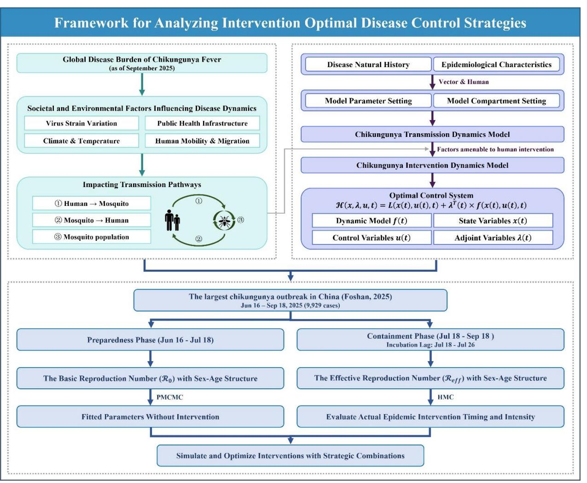

Fig. 7 Framework for analyzing intervention optimal disease control strategies.

The Hamiltonian function integrates the state equations, costate variables (Lagrange multipliers), and the integrand of the objective function as follows:

$$\mathcal{H}(x,\lambda,u,t) = L(x(t),u(t),t) + \lambda^T(t) \times f(x(t),u(t),t),$$

where x(t) represents the vector of state variables, u(t) denotes the control variables to be determined,  $L(\cdot)$  corresponds to the integrand (running cost) of the objective function,  $f(\cdot)$  describes the system dynamics, and  $\lambda(t)$  refers to the costate variables (also known as adjoint variables), with t = 0, ..., T. According to Pontryagin's Maximum Principle, the optimal control  $u^*(t)$  must minimize (or maximize) the Hamiltonian  $\mathcal{H}$  over the entire time horizon. By taking the partial derivative of  $\mathcal{H}$  with respect to the control variable u and setting it to zero, i.e.,

$$\frac{\partial \mathcal{H}}{\partial u} = 0,$$

an explicit expression for the optimal control exists and can be derived as a function of the state variables x(t) and costate variables  $\lambda(t)$ , yielding  $u^* = u^*(x, \lambda)$  (43-44).

Solving the aforementioned optimal control system requires simultaneously satisfying both the state equations and the costate equations. The state equation

$$\dot{x} = f(x, u, t),$$

is integrated forward in time with the initial condition  $x(0) = x_0$ , while the costate equation

$$\dot{\lambda} = -\frac{\partial \mathcal{H}}{\partial x},$$

is integrated backward with the terminal condition  $\lambda(T) = 0$ . To numerically solve this coupled system, we employ the forward-backward sweep method, which iteratively performs the following steps: First, given the current estimate of the control variables, the state equations are integrated forward to obtain the state trajectory; Second, using the current state trajectory, the costate equations are integrated backward to determine the costate trajectory; Finally, the control variables are updated according to the Hamiltonian minimization condition  $u^* = u^*(x, \lambda)$ .

To ensure algorithm stability and convergence, a relaxation update strategy is introduced:

$$u_{new} = (1 - \omega)u_{old} + \omega u_{calculated},$$

where  $\omega \in (0,1)$  is the relaxation (or damping) factor. The updated control variables are then projected onto the admissible control set U (e.g.,  $u_{\min} \le u(t) \le u_{\max}$ ), which essentially implements a form of the projected gradient method. The iteration continues until the relative change in the control variables falls below a preset tolerance or the maximum number of iterations is reached.

#### References

- Bartholomeeusen, K., Daniel, M. & LaBeaud, D. A. et al. Chikungunya fever. Nat. Rev. Dis. Primers 9, 17 (2023).
- 2. Vairo, F., Haider, N. & Kock, R. *et al.* Chikungunya: epidemiology, pathogenesis, clinical features, management, and prevention. *Infect. Dis. Clin. North Am.* **33**, 1003–1025 (2019).
- 3. Powers, A. M. & Logue, C. H. Changing patterns of chikungunya virus: re-emergence of a zoonotic arbovirus. *J. Gen. Virol.* **88**, 2363–2377 (2007).
- 4. European Centre for Disease Prevention and Control (ECDC). Chikungunya virus disease worldwide overview. Available from: <a href="https://www.ecdc.europa.eu/en/chikungunyamonthly">https://www.ecdc.europa.eu/en/chikungunyamonthly</a> (cited 13 Nov 2025).
- 5. Kang, H., Lim, A. & Auzenbergs, M. *et al.* Global, regional and national burden of chikungunya: force of infection mapping and spatial modelling study. *BMJ Glob. Health* **10**, e018598 (2025).
- 6. Lin, B. L., Xie, D. Y. & Zhai, J. Q. *et al.* Investigation of confirmed cases with chikungunya fever in Dongguan. *J. Sun Yat-sen Univ.: Med. Sci. Ed.* **32**, 208–212 (2011).
- 7. Chen, B., Chen, Q. L. & Li, Y. *et al.* Epidemiological characteristics of imported chikungunya fever cases in China, 2010–2019. *Dis. Surveill.* **36**, 539–543 (2021).
- 8. Wu, D., Wu, J. & Zhang, Q. et al. Chikungunya outbreak in Guangdong Province, China, 2010. Emerg. Infect. Dis. 18, 493–495 (2012).
- 9. Yin, X., Hu, T. S. & Zhang, H. *et al.* Emergent chikungunya fever and vertical transmission in Yunnan Province, China, 2019. *Arch. Virol.* **166**, 1455–1462 (2021).
- 10. Zhao, J., Liu, R. C. & Chen, S. L. *et al.* A model for evaluation of key measures for control of chikungunya fever outbreak in China. *Chin. J. Epidemiol.* **36**, 1253–1257 (2015).
- 11. Zhao, Y., Li, J. & Zhao, Z. *et al.* Estimating the transmissibility of the 2025 chikungunya fever outbreak in Foshan, China: a modelling study. *Infect. Dis. Poverty* **14**, 106 (2025).
- 12. Liu, Q., Shen, H. & Gu, L. *et al.* Chikungunya virus in Europe: a retrospective epidemiology study from 2007 to 2023. *PLoS Negl. Trop. Dis.* **19**, e0012904 (2025).
- 13. Simoy, M. I., Simoy, M. V. & Canziani, G. A. Herd dynamics age and sex structured model considering management practices and animal movements among districts. *Appl. Math. Model.* **96**, 53–65 (2021).
- 14. Mukhopadhyay, S. & Piepho, H. P., Bhattacharya, S. *et al.* Hierarchical Bayesian integrated modeling of age- and sex-structured wildlife population dynamics. *J. Agric. Biol. Environ. Stat.* **30**, 1068–1093 (2025).
- 15. Wu, P., Feng, Z. & Zhang, X. Global dynamics of an age-space structured HIV/AIDS model with viral load-dependent infection and conversion rates. *J. Comput. Appl. Math.* **412**, 114309 (2022).

- 16. Zhang, J., Wang, L. & Jin, Z. Global stability for age-infection-structured human immunodeficiency virus model with heterogeneous transmission. *Infect. Dis. Model*. **9**, 437– 457 (2024).
-  17. Huo, J., Huo, Q. & Yuan, R. Threshold dynamics for infection age-structured epidemic models with spatial diffusion and degenerate diffusion. *J. Dyn. Differ. Equ*. **37**, 251–296 (2025).
-  18. Forouzannia, F. & Gumel, A. B. Dynamics of an age-structured two-strain model for malaria transmission. *Appl. Math. Comput*. **250**, 860–886 (2015).
-  19. Uwineza, M. A., Nzabanita, J. & Ngaruye, I. *et al.* A deterministic analysis of an age-sex-structured model for malaria transmission dynamics. *IJID Reg.* **13**, 100478 (2024).
-  20. Cortes-Azuero, O., O'Driscoll, M. & Ribeiro Dos Santos, G. *et al*. The epidemiology of chikungunya virus in Brazil and the potential impact of vaccines: a mathematical modelling study. *Lancet Infect. Dis.* Published online (2025).
-  21. World Health Organization (WHO). Chikungunya virus disease – Global situation. *Disease Outbreak News* (23 Oct 2025). Available from: [https://www.who.int/emergencies/disease-](https://www.who.int/emergencies/disease-outbreak-news/item/2025-DON581)[outbreak-news/item/2025-DON581](https://www.who.int/emergencies/disease-outbreak-news/item/2025-DON581) (cited 12 Dec 2025).
-  22. Zhang, M., Li, Y. & Huang, X. *et al*. Epidemiological characteristics and transmission dynamics of the early stage Chikungunya fever outbreak in Foshan City, Guangdong Province, China in 2025. *Infect. Dis. Poverty.* **14**, 93 (2025).
-  23. Foshan Municipal Bureau of Statistics. Available from: [https://www.foshan.gov.cn/gzjg/stjj/tjnj\\_1110962/](https://www.foshan.gov.cn/gzjg/stjj/tjnj_1110962/) (cited 10 Oct 2025).
-  24. Li, Y. & Liu, L. The impact of Wolbachia on dengue transmission dynamics in an SEI-SIS model. *Nonlinear Anal. Real World Appl.* **62**, 103363 (2021).
-  25. Chitnis, N., Hyman, J. M. & Cushing, J. M. Determining important parameters in the spread of malaria through the sensitivity analysis of a mathematical model. *Bull. Math. Biol.* **70**, 1272–1296 (2008).
-  26. Agarwal, A., Bhardwaj, N. & Sharma, S. K. *et al*. Evidence of experimental vertical transmission of emerging novel ECSA genotype of chikungunya virus in Aedes aegypti. *PLoS Negl. Trop. Dis.* **8**, e2990 (2014).
-  27. Honório, N. A., Wiggins, K. & Eastmond, B. *et al*. Experimental vertical transmission of chikungunya virus by Brazilian and Florida Aedes albopictus populations. *Viruses* **11**, 353 (2019).
-  28. Cai, X., Li, Z. & Liu, Y. *et al*. Effects of temperature, relative humidity, and illumination on the entomological parameters of Aedes albopictus: an experimental study. *Int. J. Biometeorol.* **67**, 687–694 (2023).
-  29. Yang, D., Li, C. & Li, M. *et al*. Semi-field life-table studies of Aedes albopictus (Diptera: Culicidae) in Guangzhou, China. *PLoS One* **15**, e0229829 (2020).
-  30. Jourdain, F., Lambert, G. & Roux, J. *et al*. Estimating chikungunya virus transmission parameters and vector control effectiveness highlights key factors to mitigate arboviral disease outbreaks. *PLoS Negl. Trop. Dis.* **16**, e0010259 (2022).
- 31. Dumont, Y., Chiroleu, F. & Domerg, C. On a temporal model for the Chikungunya disease: modeling, theory and numerics. *Math. Biosci.* **213**, 80–91 (2008).
- 32. Christofferson, R. C., Chisenhall, D. M. & Wearing, H. J. *et al*. Chikungunya viral fitness measures within the vector and subsequent transmission potential. *PLoS One.* **9**, e110538 (2014).
-  33. González-Parra, G. C., Aranda, D. F. & Chen-Charpentier, B. *et al*. Mathematical modeling and characterization of the spread of chikungunya in Colombia. *Math. Comput. Appl.* **24**, 6 (2019).
-  34. de Lima Cavalcanti, T. Y. V., Pereira, M. R. & de Paula, S. O. *et al*. A review on chikungunya virus epidemiology, pathogenesis and current vaccine development. *Viruses* **14**, 969 (2022).

-  35. Alade, T. O., Alnegga, M. & Olaniyi, S. *et al*. Mathematical modelling of within-host Chikungunya virus dynamics with adaptive immune response. *Model. Earth Syst. Environ.* **9**, 3837–3849 (2023).
-  36. Ribeiro dos Santos, G., Jawed, F. & Mukandavire, C. *et al*. Global burden of chikungunya virus infections and the potential benefit of vaccination campaigns. *Nat. Med.* **31**, 2342–2349 (2025).
-  37. Andrieu, C., Doucet, A. & Holenstein, R. Particle Markov chain Monte Carlo methods. *J. R. Stat. Soc. B.* **72**, 269–342 (2010).
-  38. Doucet, A. & Johansen, A. M. A tutorial on particle filtering and smoothing: fifteen years later. in *The Oxford Handbook of Nonlinear Filtering* 656–704 (Oxford University Press, Oxford, 2011).
-  39. Gelman, A., Carlin, J. B. & Stern, H. S. *et al*. *Bayesian Data Analysis* 3rd edn (Chapman and Hall/CRC, Boca Raton, 2013).
-  40. Zhang, C. R. & Zheng, B. D. *Biomathematics - Dynamic Models, Methods and Applications* (Science Press, Beijing, 2018).
- 41. Pontryagin, L. S. *Mathematical Theory of Optimal Processes* (Routledge, New York, 1987).
-  42. Lenhart, S. & Workman, J. T. *Optimal Control Applied to Biological Models* (Chapman and Hall/CRC, Boca Raton, 2007).
-  43. Area, I., Ndaïrou, F. & Nieto, J. J. *et al*. Ebola model and optimal control with vaccination constraints. *J. Ind. Manag. Optim.* **14**, 427–466 (2018).
-  44. Tadmon, C. & Kengne, J. N. Mathematical analysis of a model of Ebola disease with control measures. *Int. J. Biomath.* **07**, 2250048 (2022).
-  45. Nama, N., Ma, Y. & Zhou, J. *et al*. The outbreak, response, and reflections on the chikungunya fever epidemic in Foshan City, China. *Glob. Health Res. Policy* **10**, 59 (2025).
-  46. Saha, P., Sikdar, G. C. & Ghosh, U. Transmission dynamics and control strategy of single-strain dengue disease. *Int. J. Dyn. Control* **11**, 1396–1414 (2023).
-  47. Khatua, A. & Kar, T. K. Dynamical behavior and control strategy of a dengue epidemic model. *Eur. Phys. J. Plus* **135**, 643 (2020).
-  48. Abidemi, A. & Peter, O. J. Host-vector dynamics of dengue with asymptomatic, isolation and vigilant compartments: insights from modelling. *Eur. Phys. J. Plus* **138**, 199 (2023).
-  49. Sun, H., Koo, J. & Dickens, B. L. *et al*. Short-term and long-term epidemiological impacts of sustained vector control in various dengue endemic settings: a modelling study. *PLoS Comput. Biol.* **18**, e1009979 (2022).
-  50. Raj, M. P., Venkatesh, A. & Kumar, K. A. *et al*. Dengue transmission model in an age-structured population using delay differential equations. *Discov. Public Health* **22**, 91 (2025).
-  51. Maure, C., Khazhidinov, K. & Kang, H. *et al*. Chikungunya vaccine development, challenges, and pathway toward public health impact. *Vaccine* **42**, 126483 (2024).
-  52. Ryan, S. J., Carlson, C. J. & Mordecai, E. A. *et al*. Global expansion and redistribution of Aedes-borne virus transmission risk with climate change. *PLoS Negl. Trop. Dis.* **13**, e0007213 (2019).
- 53. Tjaden, N. B., Suk, J. E. & Fischer, D. *et al*. Modelling the effects of global climate change on Chikungunya transmission in the 21st century. *Sci. Rep.* **7**, 3813 (2017).
-  54. Kraemer, M. U. G., Reiner, R. C. & Brady, O. J. *et al*. Past and future spread of the arbovirus vectors Aedes aegypti and Aedes albopictus. *Nat. Microbiol.* **4**, 854–863 (2019).
-  55. European Centre for Disease Prevention and Control (ECDC). Mosquito-borne diseases: an emerging threat. Available from: [https://www.ecdc.europa.eu/en/publications-data/mosquito-](https://www.ecdc.europa.eu/en/publications-data/mosquito-borne-diseases-emerging-threat)[borne-diseases-emerging-threat](https://www.ecdc.europa.eu/en/publications-data/mosquito-borne-diseases-emerging-threat) (cited 13 Nov 2025).
-  56. Abdul-Ghani, R., Fouque, F. & Mahdy, M. A. K. *et al*. Multisectoral approach to address chikungunya outbreaks driven by human mobility: a systematic review and meta-analysis. *J. Infect. Dis.* **222**, S709–S716 (2020).

 57. Staples, J. E. & Fischer, M. Chikungunya virus in the Americas--what a vector borne pathogen can do. *N Engl J Med*. **371**(10), 887–9 (2014).

### **Acknowledgments**

 This work is supported by the Self-supporting Program of Guangzhou Laboratory (GZNL2024A01004 and SRPG22-007), the National Key Research and Development Program of China (2024YFC2311404), the China Postdoctoral Science Foundation (K2825002), the Postdoctoral Fellowship Program of CPSF (GZC20250516), and the Prevention and Control of Emerging and Major Infectious Diseases-National Science and Technology Major Project (2025ZD01900406).

### **Author contributions**

 Conceptualization: T. M. C., J. H. L., Z. Y. Z., J. R. Investigation: J. H. L., Z. Y. Z., J. R., J. G. Z., Q. X. L, W. T. S., Q. P. C. Methodology: J. H. L., Z. Y. Z., J. R., S. P., R. F. Software: J. H. L., J. G. Z., Q. X. L. Validation: Z. Y. Z., J. R., K. G. L., S. P., R. F., Y. H. S., X. T. X. Writing— original draft: J. H. L., J. G. Z., Q. X. L., K. G. L. Writing—review & editing: J. H. L., Z. Y. Z., J. R., S. P., R. F., Y. H. S., Q. P. C., X. T. X., T. M. C. All authors read and approved the final manuscript.

## **Competing interests**

The authors declare no competing interests.

# **Figures and Tables**

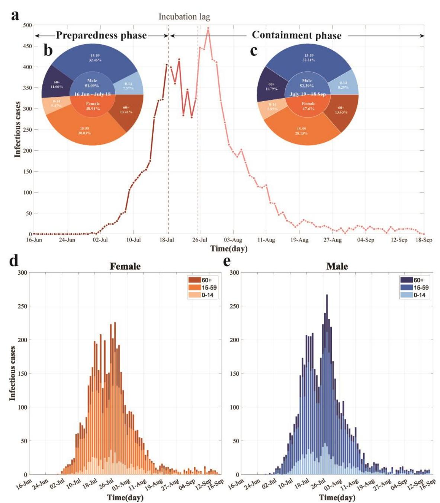

**Fig. 1 Temporal dynamics and demographic characteristics of the largest recorded CHIK outbreak in China. (a)** Daily reported cases by containment phase. The timeline is segmented into distinct phases, annotated with black text and arrows, with colors indicating temporal progression. **(b–c)** Age and sex distribution of incident cases during the preparedness phase (b) and containment phase (c). (d–e) Daily cases by age group among females (d) and males (e). Colors represent sex (blue: male; orange: female) and age groups (light to dark shades: 0–14, 15– 59, and 60+ years, respectively).

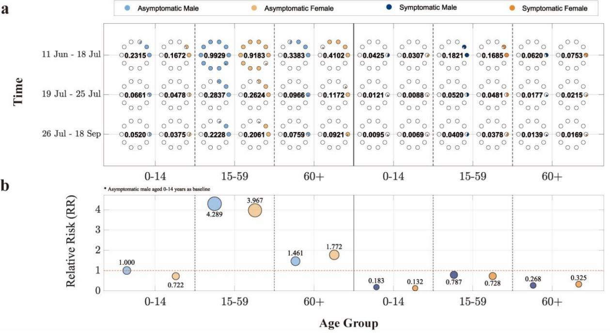

**Fig. 2 Demographic decomposition and relative risk analysis of the basic reproduction number () in the largest CHIK outbreak in China. (a)** ℛ0 stratified by sex, age group, and infection status (asymptomatic/symptomatic) across different containment phases. The horizontal axis represents age groups, the vertical axis indicates time periods, and point size corresponds to ℛ0 values (each hollow circle represents 0.1). **(b)** Relative risk of other population subgroups compared to the reference group (asymptomatic males aged 0–14 years). The solid red line marks the baseline. The vertical position and area of each circle denote the magnitude of relative risk. Blue and orange colors denote male and female cases, respectively, while light and dark blue shades represent asymptomatic and symptomatic infections.

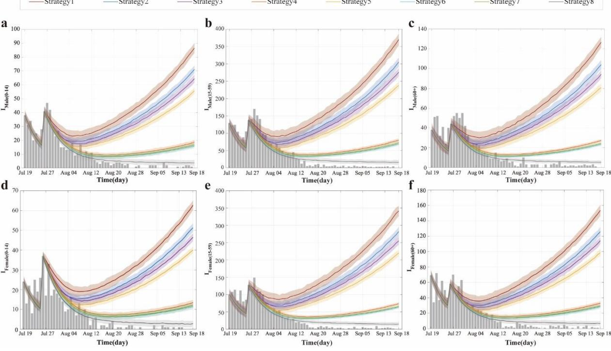

**Fig. 3 Simulated infection counts by population group under different control strategies in the largest recorded CHIK outbreak in China. (a–f)** Temporal dynamics of infections for six population groups: males 0–14 years (a), males 15–59 years (b), males 60+ years (c), females 0–

 14 years (d), females 15–59 years (e), and females 60+ years (f). Dark gray bars represent observed infections. The dark red curve (Strategy 1) represents the no-intervention control group based on segmented fitting of Model (1), while the dark gray curve (Strategy 8) corresponds to the actual control group based on segmented fitting of Model (2).

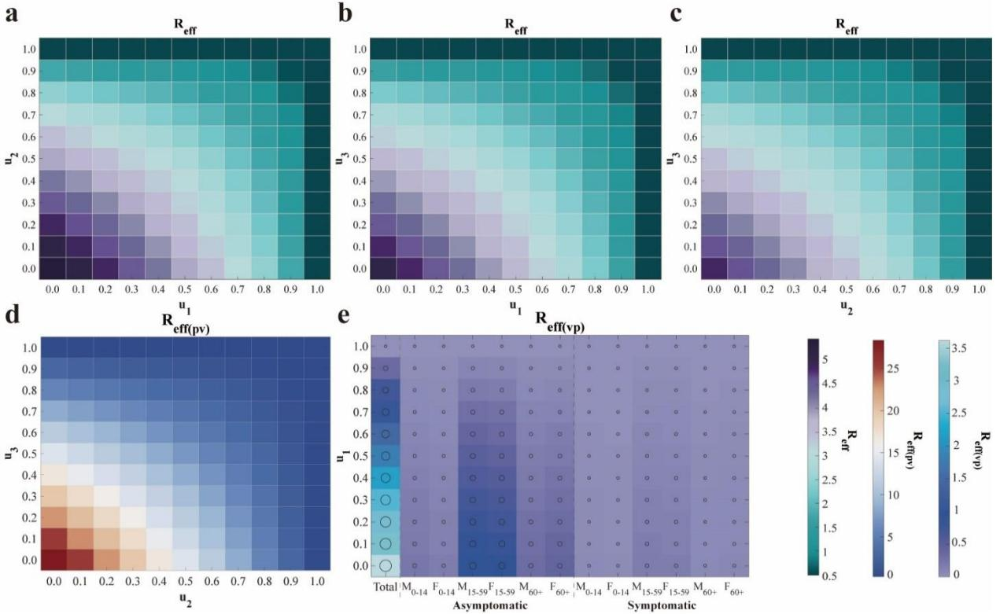

**Fig. 4 Heatmap analysis of the impact of control strategy combinations on the effective reproduction number ( ). (a)–(c)** Effects on the overall ℛ when altering combinations of the other two control measures while fixing one strategy at its actual implementation value. **(d)** Variation of the human-to-mosquito effective reproduction number (ℛ() ) with changes in 2 and 3. **(e)** Variation of the mosquito-to-human effective reproduction number (ℛ() ) and its subcomponents with changes in 1. The axes correspond to the intensities of controlling mosquito-to-human transmission (1), human-to-mosquito transmission (2), and mosquito population suppression (3). Each row of subplots employs a different value range and colormap standard.

**Fig. 5 Compartmental structure of the CHIKV transmission model.**

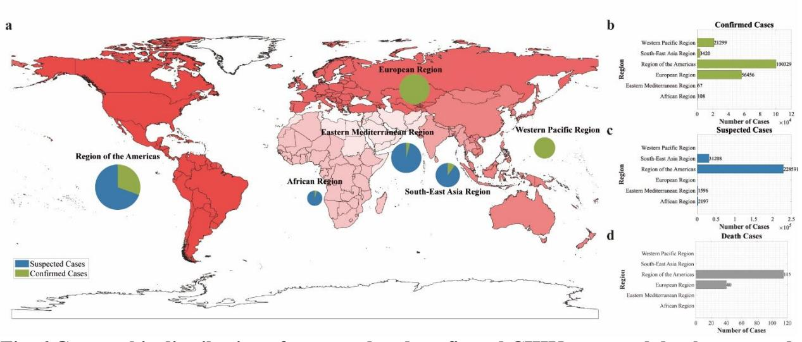

**Fig. 6 Geographic distribution of suspected and confirmed CHIK cases and deaths reported to WHO or shared publicly by national ministries of health by region, as of September 2025. (a)** Burden distribution map by region: color intensity represents case severity, while pie charts show the proportion of suspected versus confirmed cases within each region. **(b)–(d)** Statistics of confirmed cases, suspected cases, and deaths by region, respectively.

919 **Fig. 7 Framework for analyzing intervention optimal disease control strategies.**

921 **Table 1. Contribution of cross-species transmission pathways to the basic reproduction**  922 **number () in the largest CHIK outbreak in China**

| Time          | 𝓡𝟎      | 𝓡𝟎(𝒗𝒑) | 𝓡𝟎(𝒑𝒗)  |
|---------------|---------|--------|---------|
| 11 Jun-18 Jul | 10.1235 | 3.6197 | 28.3132 |
| 19 Jul-18 Sep | 1.3865  | 0.8665 | 2.2185  |
| 19 Jul-25 Jul | 1.2934  | 1.0341 | 1.6178  |
| 26 Jul-18 Sep | 1.3243  | 0.8122 | 2.1593  |

924 **Table 2. Parameterization of Intervention Measures**

| Intervention pathway                        | Control functions | Parameter adjustment                 |
|---------------------------------------------|-------------------|--------------------------------------|
| ① Mosquito-to-human transmission control | (𝑡) 𝑢1         | (𝑡))𝛽𝑣𝑝 𝛽𝑣𝑝 ≜ (1 − 𝑢1 |
| ② Human-to-mosquito transmission control | (𝑡) 𝑢2         | (𝑡))𝛽𝑝𝑣 𝛽𝑝𝑣 ≜ (1 − 𝑢2 |
| ③ Mosquito population suppression        | (𝑡) 𝑢3         | (𝑡))𝑥𝑁𝑝 𝑁𝑣 = (1 − 𝑢3  |

926 **Table 3. Design of Intervention Strategy Combinations Based on Transmission Pathway**  927 **Analysis**

| Strategy | Mosquito-to-human       | Human-to-mosquito       | Mosquito population |  |
|----------|-------------------------|-------------------------|---------------------|--|
|          | transmission control 𝒖𝟏 | transmission control 𝒖𝟐 | suppression 𝒖𝟑      |  |

| Strategy 1 0 | 0             | 0             | 0             |
|-------------------------|---------------|---------------|---------------|
| Strategy 2              | HMC-Estimated | 0             | 0             |
| Strategy 3              | 0             | HMC-Estimated | 0             |
| Strategy 4           | 0             | 0             | HMC-Estimated |
| Strategy 5           | HMC-Estimated | HMC-Estimated | 0             |
| Strategy 6              | HMC-Estimated | 0             | HMC-Estimated |
| Strategy 7           | 0             | HMC-Estimated | HMC-Estimated |
| Strategy 8 1 | HMC-Estimated | HMC-Estimated | HMC-Estimated |

Table 4. Definition and value of parameters in the transmission dynamics model

| Parameters   | Definition                                                            |                  | Value  | Range             | Source           |
|--------------|-----------------------------------------------------------------------|------------------|--------|-------------------|------------------|
| $\beta_{vp}$ | Effective transmission rate from mosquitoes to human                  |                  | -      | 0-1               | Fitting          |
| $\beta_{pv}$ | Effective transmission rate from human to mosquito                    |                  | -      | 0-1               | Fitting          |
| x            | The ratio of mosquitoes to human total number                         | 1                | -      | 5-15              | Fitting          |
| а            | Per capita birth rate of mosquitoes                                   | Day - | 0.145  | 0.02-0.27         | Ref. (24- 25) |
| τ            | Simulation delay in the initial time in the whole season day          | Day              | 30     | -                 | Estimation       |
| T            | Duration of the daily cycle                                           | Day              | 365    | -                 | Estimation       |
| n            | The minimum infection rate for vertical transmission                  | 1                | 0.0181 | 0.0076- 0.0286 | Ref. (26- 27) |
| λ            | Rate of mosquito emergence                                            | Day - | 0.0902 | 0.0691- 0.1296 | Ref. (28)        |
| d            | Natural mortality rate of mosquitoes                                  | Day - | 1/7.4  | 1/9.8- 1/4.5   | Ref. (29)        |
| ω            | Transition rate of infection in mosquitoes from exposed to infectious | Day - | 1/5.5  | 1/8.2-1/3         | Ref. (30- 33) |

| q         | Proportion of exposed individuals progressing to asymptomatic individuals | 1                | 0.155 | 0.03-0.28 | Ref. (34- 35) |
|-----------|---------------------------------------------------------------------------|------------------|-------|-----------|------------------|
| ω         | Transition rate of exposed individuals to the symptomatic individuals     | Day-             | 1/4.5 | 1/7-0.5   | Ref. (34- 35) |
| $\omega'$ | Transition rate of exposed individuals to the asymptomatic individuals    | Day - | 1/4.5 | 1/7-0.5   | Ref. (34- 35) |
| γ         | Recovery rate of symptomatic individuals                                  | Day - | 1/7   | -         | Ref. (36)        |
| $\gamma'$ | Recovery rate of asymptomatic individuals                                 | Day 1            | 1/7   | -         | Ref. (36)        |